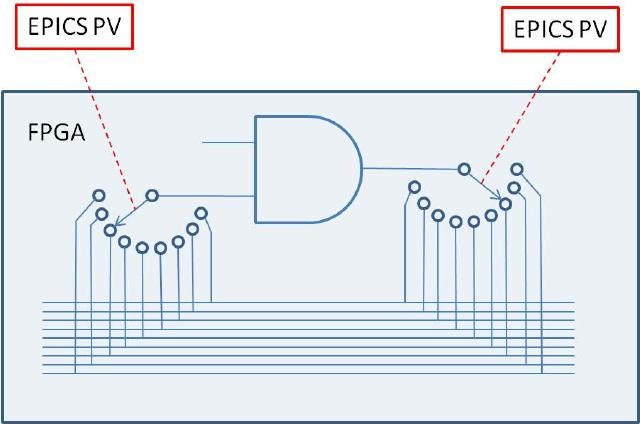

# softGlue
{: .no_toc}

## Table of contents
{: .no_toc .text-delta }

- TOC
{:toc}

## Overview

The [synApps](http://epics-synapps.github.io/support/) softGlue module
enables [EPICS](http://www.aps.anl.gov/epics) users and application
developers to construct small, simple, digital electronic circuits, and
to connect those circuits to field wiring, all by writing to EPICS PVs.
Because the circuits and field connections are defined entirely by EPICS
PVs, they can be saved and restored with
[autosave](https://epics-modules.github.io/autosave/), saved as text
files (for example, as BURT snapshot files), emailed from one user to
another, etc. softGlue also provides safe (throttled) user control over
how hardware interrupts are generated by field I/O signals, and how
they are dispatched to cause EPICS processing.

The name *softGlue* is intended to suggest *glue electronics*
implemented by *software*, where *glue electronics* means those little
bits of digital circuitry needed to connect two or more larger pieces of
digital electronics into a working whole.

softGlue does this by loading an IndustryPack FPGA-based digital I/O
module with a predefined collection of circuit elements (logic gates,
counters, flip-flops, etc.), whose inputs and outputs are connected to
switches controlled by EPICS PVs. softGlue provides a user interface
for controlling those switches, allowing inputs and outputs to be marked
with user-specified names, and connecting or driving inputs and outputs
according to those names.

Here is the underlying idea, schematically:

## Requirements

To use softGlue, you must have the following hardware and software.

### Hardware

- An IndustryPack (IP) carrier board supported by the EPICS ipac module.
- An Acromag IP-EP20x FPGA IP module.

{: .note }
> softGlue 2.x is intended to be usable with any IP_EP200-series
> module, but the databases and MEDM displays supplied in this version
> are for the IP_EP201, and other modules in the series have not yet
> been tested. The differences between modules are in the numbers of
> I/O bits and the pinout.

### Software

- [asyn](https://github.com/epics-modules/asyn), version 4.6 or higher.
- [ipac](https://github.com/epics-modules/ipac), version 2.11 or higher.
  To use an earlier version, see "Building softGlue" in the
  [Installation](softGlueInstallation.html) page.
- The EPICS extension
  [msi](http://www.aps.anl.gov/epics/extensions/msi/index.php), version
  1-5 or higher. This tool is needed to build some softGlue databases.
- MEDM, or CSS-BOY, or caQtDM, or the ability to adapt some other
  display manager or Channel Access client to implement softGlue's user
  interface.

{: .note }
> softGlue versions 2.1 and lower also require the EPICS
> [calc](https://github.com/epics-modules/calc) module. Some of the
> databases, displays, and examples presume the availability of other
> synApps modules, such as calc,
> [busy](https://github.com/epics-modules/busy), and
> [std](https://github.com/epics-modules/std), but these are not
> needed for any essential feature of softGlue.

You do **not** need to be able to program the IP-EP20x module. In the
default implementation, the FPGA content is programmed automatically
into the module at IOC-boot time, via the IP bus. A text file is
included with softGlue for this purpose. softGlue attempts to load
the FPGA on every IOC boot, but the load succeeds only on a cold boot.
A warm boot leaves previously loaded content in place.

{: .note }
> If you have a copy of Altera's Quartus software, you can load your
> own custom FPGA content into the module and use softGlue to talk to
> it. softGlue was designed with this use in mind, though documentation
> on how it's done is not yet available.

## Capabilities

Here are a few examples of the sorts of things that can be accomplished
with softGlue and EPICS:

- With no programming at all, softGlue functions simply as good support
  for a 48-bit digital I/O module.
- Conditionally send a trigger signal to a detector after every N steps
  of a stepper motor.
- Conditionally send a trigger signal to a detector after every N(i)
  steps of a stepper motor, where N(i) is an array of step-interval
  numbers.
- Gate a detector off during the acceleration and deceleration portions
  of a stepper motor's motion.
- Send a trigger to a detector precisely 23 ms after sending a trigger
  to a shutter.
- Conditionally trigger the execution of an EPICS record on the change
  of state of an external signal.
- Implement an extraordinarily smart trigger signal for an oscilloscope.
- Implement efficiently a timer usable by EPICS software, with a time
  resolution that is much better than the system clock's resolution.
  (With this, you can for example cause an EPICS database to wait for
  0.7 ms.)

## Implemented circuit elements

In the standard FPGA content, softGlue provides the following circuit
elements:

- Four AND gates
- Four OR gates
- Four noninverting buffers
- Two XOR gates
- Four D flip-flops
- Two 2-input/1-output multiplexers
- Two 1-input/2-output demultiplexers
- Four 32-bit counters
- Four 32-bit preset counters
- Four 32-bit divide-by-N circuits
- 48 field-input bits
- 48 field-output bits
- One 8 MHz clock signal

{: .warning }
> Earlier versions of softGlue implemented many components with both
> inverting and noninverting outputs. Beginning with 2.0, signal
> inversion is accomplished by appending `*` to a signal name, and this
> removes the need to implement inverted outputs. Unfortunately, this
> means that softGlue PV values saved from an earlier version of
> softGlue will not restore correctly in softGlue 2.x. The
> functionality of the circuit will certainly still be achievable, but
> signal names have changed, and the circuit will have to be
> re-engineered.

In addition to the above listed components, softGlue 2.x includes shift
registers, up/down counters, and quadrature decoders in separate FPGA
packages. Currently, only one FPGA-content file can be loaded at a time
(the IP-EP20x FPGA does not support loading more than one), but the
standard softGlue FPGA content can be combined with any one add-on
package. Thus, there is a clear path to standard softGlue plus
application-specific FPGA content and support. softGlue databases and
display files are engineered to simplify the development of support for
add-on packages.

## Credits

The essential enabling work underlying softGlue is Eric Norum's
[IndustryPack Bridge](IndustryPackBridge.html). David Kline
engineered a proof-of-principle implementation, working from
another of Eric's bus-interface solutions, for a non-VME
architecture. Marty Smith wrote a driver to talk to custom FPGA
content interfaced to Eric's IndustryPack Bridge. Kurt Goetze and
Marty Smith implemented the FPGA content included with softGlue,
and Tim Mooney extended Marty's driver and wrote the EPICS
application.
