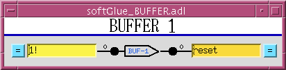
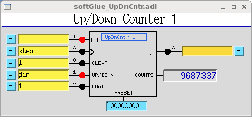
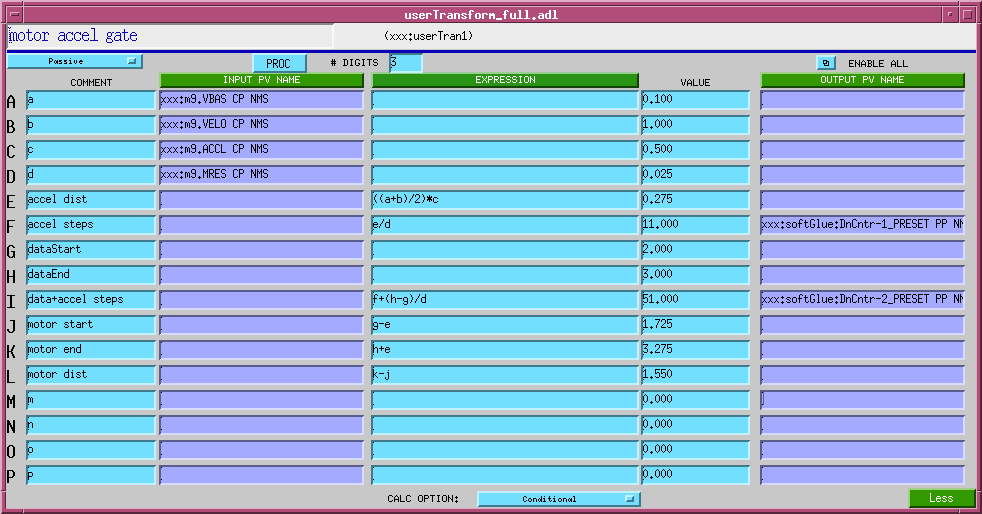

The synApps softGlue module
===========================

Table of Contents
=================

- [Overview](#Overview)
- [Installation and deployment](<#Installation and deployment>)
- [User's Manual](<#User's Manual>)
- [Add-on FPGA components](<#Add-on FPGA components>)
- [Saving and restoring circuits](<#Saving and restoring circuits>)
- [Example circuits](<#Example circuits>)
- [Field wiring](<#Field wiring>)
- [Custom Interrupt Handlers](<#Custom Interrupt Handlers>)
- [Implementation](#Implementation)


Overview
--------

The [synApps](http://epics-synapps.github.io/support/) softGlue module enables [EPICS](http://www.aps.anl.gov/epics) users and application developers to construct small, simple, digital electronic circuits, and to connect those circuits to field wiring, all by writing to EPICS PV's. Because the circuits and field connections are defined entirely by EPICS PV's, they can be [autosave](https://epics-modules.github.io/autosave/)d and restored, saved as text files (for example, as [BURT](http://www.aps.anl.gov/epics/extensions/burt/index.php) snapshot files), emailed from one user to another, etc. softGlue also provides safe (throttled) user control over how hardware interrupts are generated by field I/O signals, and how they are dispatched to cause EPICS processing. 

> The name *softGlue* is intended to suggest *glue electronics* implemented by *soft*ware, where *glue electronics* means those little bits of digital circuitry needed to connect two or more larger pieces of digital electronics into a working whole.

softGlue does this by loading an IndustryPack FPGA-based digital I/O module with a predefined collection of circuit elements (logic gates, counters, flip-flops, etc.), whose inputs and outputs are connected to switches controlled by EPICS PV's. softGlue provides a user interface for controlling those switches, allowing inputs and outputs to be marked with user-specified names, and connecting or driving inputs and outputs according to those names.

Here's the underlying idea, schematically:


### Requirements

To use softGlue, you must have the following hardware and software:

- __Hardware__
    
    
    - An IndustryPack (IP) carrier board supported by the EPICS ipac module.
    - An Acromag IP-EP20x FPGA IP module.
    
    > SoftGlue 2.x is intended to be useable with any IP\_EP200-series module, but the databases and MEDM displays supplied in this version are for the IP\_EP201, and other modules in the series have not yet been tested. The differences between modules are in the numbers of I/O bits, and the pinout.
    
- __Software__

    - The EPICS [asyn](https://www.github.com/epics-modules/asyn) module, version 4.6 or higher.
    - The EPICS [ipac](https://www.github.com/epics-modules/ipac) module, version 2.11 or higher. > To use an earlier version, see "Building softGlue" below.
    - The EPICS extension, [msi](http://www.aps.anl.gov/epics/extensions/msi/index.php), version 1-5 or higher. > This tool is needed to build some softGlue databases.
    - MEDM, or CSS-BOY, or caQtDM, or the ability to adapt some other display manager or Channel Access client to implement softGlue's user interface.

> SoftGlue versions 2.1 and lower also require the EPICS [calc](http://www.aps.anl.gov/bcda/synApps/calc/calc.html) module. Some of the databases, displays, and examples presume the availability of other synApps modules, such as calc, busy, and std, but these are not needed for any essential feature of softGlue.

You do __not__ need to be able to program the IP-EP20x module. In the default implementation, the FPGA content is programmed automatically into the module at IOC-boot time, via the IP bus. A text file is included with softGlue for this purpose. softGlue attempts to load the FPGA on every IOC boot, but the load succeeds only on a cold boot. A warm boot leaves previously loaded content in place.

> If you have a copy of Altera's "Quartus" software, you can load your own custom FPGA content into the module, and use softGlue to talk to it. softGlue was designed with this use in mind, though we don't yet have documentation on how it's done.

### Capabilities

Here are a few examples of the sorts of things that can be accomplished with softGlue and EPICS:

- With no programming at all, softGlue functions simply as good support for a 48-bit digital I/O module.
- Conditionally send a trigger signal to a detector after every N steps of a stepper motor.
- Conditionally send a trigger signal to a detector after every N(i) steps of a stepper motor, where N(i) is an array of step-interval numbers.
- Gate a detector off during the acceleration and deceleration portions of a steppermotor's motion.
- Send a trigger to a detector precisely 23 ms after sending a trigger to a shutter.
- Conditionally trigger the execution of an EPICS record on the change of state of an external signal.
- Implement an extraordinarily smart trigger signal for an oscilloscope.
- Implement efficiently a timer useable by EPICS software, with a time resolution that is much better than the system clock's resolution. (With this, you can for example cause an EPICS database to wait for 0.7 ms.)

#### Implemented circuit elements

In this version of softGlue, the FPGA is programmed with the following circuit elements: - Four AND gates
- Four OR gates
- Four noninverting buffers
- Two XOR gates
- Four D flip-flops
- Two 2-input/1-output multiplexers
- Two 1-input/2-output demultiplexers
- Four 32-bit counters
- Four 32-bit preset counters
- Four 32-bit divide-by-N circuits
- 48 field-input bits
- 48 field-output bits
- One 8MHz clock signal

> Earlier versions of softGlue implented many components with both inverting and noninverting outputs. Beginning with 2.0, signal inversion is accomplished by appending '`*`' to a signal name, and this removes the need to implement inverted outputs. Unfortunately, this means that softGlue PV values saved from an earlier version of softGlue will not restore correctly in softGlue 2.x. The functionality of the circuit will certainly still be achievable, but signal names have changed, and the circuit will have to be re-engineered.

In addition to the above listed components, softGlue 2.x includes shift registers, up/down counters, and quadrature decoders in separate FPGA packages. Currently, we don't have the capability of loading more than one FPGA-content file (the IP-EP20x FPGA does not support this), but we can combine the standard softGlue FPGA content with any one add-on package, and load that. Thus, there's a clear path to standard softGlue plus application-specific FPGA content and support. softGlue databases and MEDM-display files are engineered to simplify the development of support for add-on packages.


Installation and deployment
---------------------------

 softGlue is a synApps module, so if you've used any other synApps module, you probably already know how to install and deploy it. The important thing is that softGlue is pure support: you are not expected to run an IOC directly with it, but instead to draw from the module into your own IOC application. > Unlike most other synApps modules, however, softGlue publishes the text files needed to boot an IOC in its `db` directory (as an EPICS module really should, I suppose — most synApps modules are nonstandard in this respect), rather than in the `softGlueApp/Db` directory.

### How to get the software

 softGlue is available as part of synApps 5.5 and higher, as a tar file from the [softGlue web page](http://www.aps.anl.gov/bcda/synApps/softGlue/softGlue.html), or directly from the [synApps subversion repository](https://subversion.xray.aps.anl.gov/synApps). To export version 2.2 from the repository, for example, run the following command: `	svn export https://subversion.xray.aps.anl.gov/synApps/softGlue/tags/R2-2 softGlue-2-2	`

### Building softGlue

- Edit `softGlue/configure/RELEASE`, to specify the paths to EPICS\_BASE, ASYN, and IPAC.
- If you're using a version of IPAC older than 2.11, edit `softGlueApp/src/drvIP_EP201.c` to change the definition of the macro, `DO_IPMODULE_CHECK`, like so: 
    ```
    #define DO_IPMODULE_CHECK 0
    ```
- Run `make` in the top-level directory, using the same `make` executable used to build EPICS base. > The build will issue a warning that it can't expand all macros in substitution files. This is not an error; unexpanded macros are intended to be defined at boot time. (Note that version 1-4 of `msi` returns an error, which causes the softGlue build to fail, after writing a database file that contains unexpanded macros.)

### Deploying softGlue to an IOC

 To configure an EPICS IOC application to use softGlue, you must make modifications in the following directories, and then rebuild the application: - `configure/RELEASE`
    - Edit the `RELEASE` file to define the following names:  
    
    ```
    SOFTGLUE=<path to the softGlue module>
    ASYN=<path to the asyn module>
    IPAC=<path to the ipac module>
    BUSY=<path to the busy module>
    ```
        
    `BUSY` is an optional add-on for you to use with softGlue. If the busy module is available, you can arrange for EPICS database processing to wait for a signal from softGlue hardware before declaring itself to be finished. The `softGlue_convenience.db` database loads busy records for this purpose, and the `softGlueConvenience.adl` display file contains menu items to display the records. Nothing else in softGlue depends on the busy module.
        
- `xxxApp/src`
    - Edit `Makefile` or a `*Include.dbd` file so that the file `softGlueSupport.dbd` is included in the `.dbd` file the IOC loads at boot time. You'll also need files from asyn, ipac, and busy, if you're not already including them.  
        For a Makefile:
        
        ```
        iocxxx_DBD_vxWorks += softGlueSupport.dbd drvIpac.dbd asyn.dbd busySupport.dbd
        ```
        
         For the .dbd file that will be loaded into a vxWorks IOC: 
         ```
         include "softGlueSupport.dbd"
         include "drvIpac.dbd"
         include "asyn.dbd"
         include "busySupport.dbd"
         ```
         
    - Edit `Makefile` so that the IOC executable is linked with the `softGlue` library. You'll also need libraries from the asyn, ipac, and busy modules. The order in which libraries are named is sometimes important. Example:
        
        ```
        xxx_LIBS_vxWorks += asyn Ipac softGlue busy
        ```
- `iocBoot/ioc<em>xxx</em>`
    - Copy `softGlue/iocBoot/iocSoftGlue/softGlue.cmd` to your IOC directory, which I'll call `iocBoot/iocxxx`, and edit the `dbLoadRecords()` commands in your copy of `softGlue.cmd` to define the macro `P`, so that it's unique to your IOC. > If you'll have more than one IP\_EP20x module in an IOC, you'll also need to maintain separate definitions for the macro, `H`, for asyn port names associated with the modules, and for the macro `READEVENT`. Port names are supplied as arguments to the functions `initIP_EP200()`, `initIP_EP201(), and				initIP_EP201SingleRegisterPort()`, and they are supplied as the macro definitions `PORT`, `PORT1`, `PORT2`, and `PORT3` in `dbLoadRecords()` commands.
        
        > If you specify the same value of `READEVENT` for N instances of softGlue in a single IOC, the software will still work, but it will use N times the CPU cycles, as each instance will post read events that will cause all other instances to read from the hardware.
    - Add the following line to `st.cmd`, before the call to `iocInit()`. 
        ```
        < softGlue.cmd
        ```
    - If you use autosave: 
        - Add the following line to `save_restore.cmd`: `set_requestfile_path(softglue, "softGlueApp/Db")`
            
            > __Careful__! the first `softglue` must be all lowercase, because this is how the path variable is defined in `cdCommands`.
        - Add the following line to `auto_settings.req` (or whatever you've named the file used to save/restore PV's of arbitrary type): `file softGlue_settings.req  P=$(P) H=softGlue:`
            
            where the macros `P`, and `H` agree with those in `softGlue.cmd`.
- `xxxApp/op/adl`
    - If you use MEDM, add a related-display button to call up the `softGlueMenu.adl` display with the macros `P`, and `H`, as defined in `iocBoot/ioc<em>xxx</em>/softGlue.cmd`. The file `softGlueApp/op/adl/softGlueTop.adl` contains an example button. > If you figure out how to use softGlue with some other display manager, please tell us about it, so we can include your work in the next version of softGlue. The MEDM-display files included in softGlue make heavy use of MEDM's `composite file`, and I don't know the extent to which a comparable feature exists in other display managers. softGlue's use of `composite file` is purely a display-development convenience.
- If you use MEDM, give it access to the softGlue module's .adl files. In csh, you could do this with the following command: 
    ```
    setenv EPICS_DISPLAY_PATH $EPICS_DISPLAY_PATH':'$SOFTGLUE/softGlueApp/op/adl
    ```
- Don't forget to rebuild you application: 
    ```
    cd <applicationTop>
    ```
    
    ```
    make rebuild
    ```

### Configuring hardware

The IP-EP20x board must be configured to permit programming the FPGA via the IndustryPack bus, by moving the DIP jumper to "IP BUS". (This is the factory default setting.) ### Configuring softGlue (editing softGlue.cmd)

#### User Callable Functions:

- 
    ```
    initIP_EP200_FPGA(ushort carrier, ushort slot, char *filename)
       carrier:  IP-carrier number (numbering begins at 0)
       slot:     IP-slot number (numbering begins at 0)
       filename: Name of the FPGA-content hex file to load into the FPGA.
    
    Example:
       initIP_EP200_FPGA(0, 2, "$(SOFTGLUE)/softGlueApp/Db/SoftGlue_2_2.hex")
    
    Write content to the FPGA.  This command will fail if the FPGA already has
    content loaded, as it will after a soft reboot.  When the command fails for this
    reason, the already loaded FPGA content will be left as it was, with no ill
    effect.  To load new FPGA content, you must power cycle the ioc. 
    ```
- 
    ```
    int initIP_EP200(ushort carrier, ushort slot, char *portName1,
        char *portName2, char *portName3, int sopcBase)
        carrier:   IP-carrier number (numbering begins at 0)
        slot:      IP-slot number (numbering begins at 0)
        portName1: Name of asyn port for component at sopcBase
        portName2: Name of asyn port for component at sopcBase+0x10
        portName3: Name of asyn port for component at sopcBase+0x20
        sopcBase:  must agree with FPGA content (0x800000)
    
    Example:
        initIP_EP200(0, 2, "SGIO_1", "SGIO_2", "SGIO_3", 0x800000)
    
    Initialize basic field I/O 
    ```
- 
    ```
    int initIP_EP200_Int(ushort carrier, ushort slot, int intVectorBase,
            int risingMaskMS, int risingMaskLS, int fallingMaskMS,
            int fallingMaskLS)
        carrier:       IP-carrier number (numbering begins at 0)
        slot:          IP-slot number (numbering begins at 0)
        intVectorBase: must agree with the FPGA content loaded (0x90 for softGlue
                       2.1 and higher; 0x80 for softGlue 2.0 and lower).  softGlue
                       uses three vectors, for example, 0x90, 0x91, 0x92.
        risingMaskMS:  interrupt on 0->1 for I/O pins 33-48
        risingMaskLS:  interrupt on 0->1 for I/O pins 1-32
        fallingMaskMS: interrupt on 1->0 for I/O pins 33-48
        fallingMaskLS: interrupt on 1->0 for I/O pins 1-32
    
    Example:
        initIP_EP200_Int(0, 2, 0x90, 0x0, 0x0, 0x0, 0x0)
    
    Initialize field-I/O interrupt support
    ```
    
    > Note that interrupt vectors are hardwired in the supplied FPGA content. Each IP-EP20x module uses three vectors (0x90, 0x91, 0x92), one for each set of 16 I/O bits. Depending on the interrupt-service mechanism supported by the operating system, multiple IP-EP20x boards may or may not all be able to generate interrupts. For PowerPC processors, interrupt-service routines (ISRs) are chained, so multiple IP-EP20x modules can all generate interrupts. But if the operating system doesn't permit multiple ISRs attached to a single interrupt vector, then only one IP-EP20x board will be able to generate interrupts. See "Field I/O Interrupt support", in the "User's Manual" section, for a description of the `softGlueFieldIO_Intxx.adl` MEDM-display file by which interrupt generation can be controlled by the end user.
- 
    ```
    int initIP_EP200_IO(ushort carrier, ushort slot, ushort moduleType,
            ushort dataDir)
        carrier:    IP-carrier number (numbering begins at 0)
        slot:       IP-slot number (numbering begins at 0)
        moduleType: one of [201, 202, 203, 204]
        dataDir:    Bit mask, in which only the first 9 bits are significant.  The
                    meaning of each bit depends on moduleType, as shown in the
                    table below.  If a bit is set, the corresponding field I/O pins
                    are outputs.  Note that for the 202 and 204 modules, all I/O
                    is differential, and I/O pin N is paired with pin N+1.  For the
                    203 module, pins 25/26 through 47/48 are differential pairs.
    ```
    
    Correspondence between dataDir bits (0-8) and I/O pins (1-48) 
    
    | dataDir bit | 201 | 202 or 204 | 203 |
    |---|---|---|---|
    | bit 0 | pins 1-8 | pins 1, 3,25,27 | pins 25,27 |
    | bit 1 | pins 9-16 | pins 5, 7,29,31 | pins 29,31 |
    | bit 2 | pins 17-24 | pins 9,11,33,35 | pins 33,35 |
    | bit 3 | pins 25-32 | pins 13,15,37,39 | pins 37,39 |
    |  |  |  |  |
    | bit 4 | pins 33-40 | pins 17,19,41,43 | pins 41,43 |
    | bit 5 | pins 41-48 | pins 21,23,45,47 | pins 45,47 |
    | bit 6 | x | x | pins 1-8 |
    | bit 7 | x | x | pins 9-16 |
    |  |  |  |  |
    | bit 8 | x | x | pins 17-24 |
    
    ```
        Examples:
        1. For the IP-EP201, moduleType is 201, and dataDir == 0x3c would mean
           that I/O bits 17-48 are outputs.
        2. For the IP-EP202 or IP-EP204, moduleType is 202 or 204, and dataDir == 0x13
           would mean that I/O bits 1,3,25,27, 5,7,29,31, 17,19,41,43 are outputs.
        3. For the IP-EP203, moduleType is 203, and dataDir == 0x??? would mean
           that I/O bits 1-8, 25,27, 29,31, 33,35, 45,47 are outputs.
    ```
    
    Example:
    
    ```
        initIP_EP200_IO(0, 2, 201, 0x3c)
    ```
    
    Set field-I/O data direction
- For backward compatibility with softGlue 2.1 and earlier, the following command can be used to initialize an IP\_EP201 module, instead of the above calls to initIP\_EP200(), initIP\_EP200\_Int(), and initIP\_EP200\_IO(). This won't work for any other IP\_EP200-series module. 

    ```
    int initIP_EP201(char *portName, ushort carrier, ushort slot,
            int msecPoll, int dataDir, int sopcOffset, int interruptVector,
            int risingMask, int fallingMask)
        portName: Name of asyn port for component at sopcOffset
        carrier:         IP-carrier number (numbering begins at 0)
        slot:            IP-slot number (numbering begins at 0)
        msecPoll:        Time interval between driver polls of field I/O bits
        dataDir:         Data direction for I/O bits, explained below.
        sopcOffset:      SOPC offset (must be as in example below).
        interruptVector: Must agree with the FPGA content loaded (0x90, 0x91,
                         0x92 for softGlue 2.1 and higher; 0x80, 0x81, 0x82 for
                         softGlue 2.0 and lower).
        risingMask:      16-bit mask: if a bit is 1, the corresponding I/O bit will
                         generate an interrupt when its value goes from 0 to 1.
                         Bit 0 corresponds to field I/O pin 1, bit 1 to pin 2, etc.
        fallingMask:     Similar to risingMask, but for 1-to-0 transitions.
        
                         Note that the user can overwrite risingMask and
                         fallingMask at run time, with menu selections, and
                         probably has those selections autosaved.
    
        dataDir is a bit mask in which only bits 0 and 8 are significant.
             for sopcOffset 0x800000
                 If bit 0 of dataDir is set, I/O bits 1-8 are outputs.
                 If bit 8 of dataDir is set, I/O bits 9-16 are outputs.
             for sopcOffset 0x800010
                 If bit 0 of dataDir is set, I/O bits 17-24 are outputs.
                 If bit 8 of dataDir is set, I/O bits 25-32 are outputs.
             for sopcOffset 0x800020
                 If bit 0 of dataDir is set, I/O bits 33-40 are outputs.
                 If bit 8 of dataDir is set, I/O bits 41-48 are outputs.
    
    Example:
        initIP_EP201("SGIO_1",0,2,1000000,0x101,0x800000,0x90,0x00,0x00)
        initIP_EP201("SGIO_2",0,2,1000000,0x101,0x800010,0x91,0x00,0x00)
        initIP_EP201("SGIO_3",0,2,1000000,0x101,0x800020,0x92,0x00,0x00)
    ```
    
    > Note that interrupt vectors currently are hardwired in the supplied FPGA content. Thus, if you want to use two or more IP\_EP20x modules, only one may be permitted to generate interrupts. Interrupt generation is entirely an end-user choice, and it occurs only for the purpose of causing some EPICS record to process on the change of state of a softGlue field I/O signal. See "Field I/O Interrupt support" below for a description of the `softGlueFieldIO_Intxx.adl` MEDM-display file by which interrupt generation is controlled.
- 
    ```
    initIP_EP201SingleRegisterPort(char *portName, ushort carrier, ushort slot)
    ```
    
    Initialize softGlue signal-name support.
    
    Example:
    
    ```
    initIP_EP201SingleRegisterPort("SOFTGLUE", 0, 2)
    ```


User's Manual
-------------

Most of the essential user-interface information — how to connect signals, what the display elements mean, etc. — is contained in the descriptions of the "User Menu" and "AND" sections below. The remaining sections are mostly for completeness, though some circuit elements do require further explanation, and the counter sections introduce new display elements for registers containing decimal numbers.

We're going to have a little trouble with the meanings of "input" and "output", because they imply a viewpoint, and because we're going to be taking three different viewpoints: those of EPICS records, circuit elements, and field-wiring connectors. Usually, in EPICS, we think of an output as something to which an EPICS record can write, but that definition would be awkward here, because it would eventually require us, for example, to refer to the output of an AND gate as an "input". You just can't discuss digital circuitry intelligibly from that viewpoint.

Therefore, in this documentation, "input" and "output" will normally be from the viewpoint of one of the circuit elements we'll be wiring. Field I/O will be an exception, because it's most conveniently discussed from the viewpoint of the field-wiring connector.

### MEDM user interface

- User Menu
    
    
    
    `softGlueMenu.adl` is the top softGlue display, which serves mostly to call up other displays. The menu labelled `READ PERIOD` specifies the period at which the values of all signals are sampled for display to the user.
    
    > Most softGlue displays are not interrupt driven. (That would be a disaster, because inevitably some signals will change state at high frequency.) So, the states of inputs and outputs must be sampled periodically, for display to the user. We've found that it's confusing for users if the poll period is greater than around 1 second. We've also found that polling everything at .1 second uses only a few percent of an MVME2700 CPU.
    
- AND
    
    
    
     On the left of the AND gate are the inputs, each comprised of a blue "= button", a yellow text-entry field, a number, and what's intended to look like a red LED. On the right are essentially the same things in reverse order, but an output's text-entry field is a different color. The text-entry fields are used to connect signals together, and the color difference is intended to remind you of the only rule governing signal connections: if you connect two or more outputs together, those outputs won't work.
    
    > softGlue outputs are engineered to ensure that you can't break anything by connecting outputs together, but the circuit won't be useful until you fix the error, because the states of outputs connected together are undefined. Currently, softGlue doesn't signal this error by putting offenders into an alarm state.
    
    The yellow text-entry box controls an input. You have three options:
    
     __1. Leave empty.__   
    Inputs with empty text-entry boxes default to logic value 1. __1. Enter a string that begins with a number.__   
    This directly writes a logic value (optionally, a pulse) to the input.
    
    softGlue will parse everything that looks numberish, and convert to a floating point value. This sets the input to a logic value: 0 if the nearest integer to the converted value is zero, 1 if it's not.
    
    > Allowing floats, and extra characters after the number makes it easier to drive softGlue inputs with calcout records, replies from serial devices, etc.
    
    The strings "0!" and "1!" (possibly followed by other ignored characters) direct softGlue to write a pair of logic values: "0!" writes "0" followed immediately by "1"; "1!" writes "1" followed immediately by "0". The time interval between writes is system dependent, and not at all guaranteed, but it should be much smaller than the interval you could achieve from separate writes. On an MVME2700, I measure around 6 μs.  __1. Enter a string that begins with something other than a number.__   
    This *names* the signal, and connects it to all other signals with the same name (or with the same name followed by '`*`', as described below). Case is significant in comparing signal names.
    
    > Note that a "signal", as the word is used in this documentation, is a named connection between softGlue circuit elements. It might be more intuitive to think of a "signal" as a wire, to avoid confusing it with, say, field I/O.
    
    > Note, if you're using more than one IP-EP20x module, that you can't connect signals implemented in different IP-EP20x modules using their text-entry boxes. To accomplish this, you must connect the signals to field I/O and make a physical connection.
    
    
    If you want to use the inverted value of a signal for input to some component, append '`*`' to the signal name. This doesn't change the signal that the input is connected to, but just tells softGlue to run the signal through an inverter before applying it to the input. Note that output signal names may not end with '`*`'.
    
    In MEDM, you can use Drag-And-Drop to connect a named signal to some other signal. When you drop, MEDM will put the PV name of the signal you dragged from. When you press &lt;Enter&gt;, softGlue's device support will write the signal name of the source PV to the destination PV.
    
    In caQtDM, you can select the text of a signal name, and use Copy/Paste (^C/^V) to copy the signal name from one text-entry box to another.
    
    Whatever option you choose, you can define at most fifteen different signal names. When you try to define the 16th name, softGlue will erase whatever you wrote, and put the record into the "INVALID" alarm state. (But note, for example, that `reset` and `reset*` are not different signal names, because the trailing '`*`' is not regarded as part of the name; it merely describes how the signal should be used.)
    
    Text-entry boxes for output signals won't accept names beginning with a number, or ending with '`*`'. (softGlue will simply strip the offending characters, and leave the rest.)
    
    > A signal name beginning with a number can only be a direct-write command; it cannot connect things together, because the leading number would be misinterpreted by input-signal-name parsing as a direct-write command. Output-signal names ending with '`*`' are logically sensible, but are not permitted; this simplifies the implementation of '`*`' appended to input-signal names.
    
    A signal's blue "= button" is used to find all other signals to which the signal is connected. While a signal's "= button" is pressed, input signals connected to it are bordered in green, and output signals connected to it are bordered in orange. If you ever see two or more orange borders at the same time, you have outputs connected together, and your circuit won't work.
    
    The little red and black filled circles (LED's), and the numbers next to them, display the states of their signals. These display elements are updated at the period specified in the `softGlueMenu.adl` display. If you want the EPICS PV name corresponding to a signal's logic value, this is the PV name to use.
    
    For completeness, here's the truth table for an AND gate:
    
    | input1 | input2 |  | output |
    |---|---|---|---|
    | 0 | x |  | 0 |
    | x | 0 |  | 0 |
    | 1 | 1 |  | 1 |
    
    > 'x' means "either 0 or 1".
    
- OR
    
    
    
    | input1 | input2 |  | output |
    |---|---|---|---|
    | 0 | 0 |  | 0 |
    | 1 | x |  | 1 |
    | x | 1 |  | 1 |
    

- BUFFER
    
    
    
    The purpose of the buffer element is to permit EPICS to drive several softGlue inputs by writing to a single PV, without using up a more valuable circuit element, such as the XOR gate below.
    

- INVERTING BUFFER
    
    
    
    There is no inverting buffer - or any other inverting gate - in softGlue. Signal inversion is accomplished by appending '\*' to the name of a signal used as as input to any logic element, as demonstrated above for the buffer element. Note that '\*' appended to the name of an output signal will be removed.
    
- XOR
    
    
    
    | input1 | input2 |  | output |
    |---|---|---|---|
    | 0 | 0 |  | 0 |
    | 0 | 1 |  | 1 |
    | 1 | 0 |  | 1 |
    | 1 | 1 |  | 0 |
    
- D FlipFlop
    
    
    
    The input signal labelled "&gt;" is the "clock" input. Unlike other signals, clock inputs are edge sensitive. All clock inputs in softGlue act on the rising edge of the input signal.
    
    The open circle ("bubble") in the `SET` and `CLEAR` inputs' signal paths indicate that these signals are inverted before being used. Thus, applying '0' to the `CLEAR` input causes the output to be "cleared" (given the value 0).
    
    | SET | CLEAR | D | &gt; (clock) |  | Q |
    |---|---|---|---|---|---|
    | 0 | 0 | x | x |  | undefined |
    | 0 | 1 | x | x |  | 1 |
    | 1 | 0 | x | x |  | 0 |
    | 1 | 1 | any | rising edge |  | DBEFORE (value D had immediately before the rising edge of the clock signal) |
    
- 2-Input Multiplexer
    
    
    
    When `SEL==0`, `OUT=IN0`. When `SEL==1`, `OUT=IN1`.
    
- 2-Output Demultiplexer
    
    
    
    When `SEL==0`, `OUT0=IN`, and `OUT1` is undefined (currently 0). When `SEL==1`, `OUT1=IN`, and `OUT0` is undefined (currently 0).
    
- Up Counter (32-bit Counter)
    
    
    
    `EN==1` enables the clock ("&gt;") input, whose rising edge increments the counter value.
    
- Down Counter (32-bit Preset Counter)
    
    
    
    `EN==1` enables the clock ("&gt;") input, whose rising edge decrements the counter value. When `LOAD==1` the counter is loaded with the value applied to the `PRESET`input. While `LOAD==1`, the counter does not count down. While `LOAD==0` and `EN==1`, a rising edge at the clock input decrements the counter. When the counter value reaches `0`, the output `Q` goes to `1`; the next rising edge of the clock returns `Q` to `0` (regardless of the states of `EN` and `LOAD`).
    
- 32-bit Divide By N
    
    
    
    `EN==1` enables the clock ("&gt;") input. Every `N`'th rising edge of the clock drives `Q` to `1`. The next rising edge returns `Q` to `0`. This behavior produces the correct number of rising edges of the output signal, but it does not guarantee the same number of falling edges. Therefore, using an inverted copy of the output to clock downstream electronics will in some cases have inconsistent results. When `N`==`0`, the divide circuitry is bypassed, and the clock is connected directly to `Q`. This is an error; the output should still be gated by the `EN` signal.
    
    In softGlue version 2.1 and earlier, the `RESET` signal doesn't do anything. Beginning with softGlue 2.2, the `RESET` signal loads the counter with `N`, so that `Q` will be driven to `1` after `N` rising edges of the clock. `RESET` does not clear the output `Q`. If `Q`is `1`, it will be cleared on the first rising edge of the clock.
    
- 8 MHz internal clock
    
    
    
    An 8 MHz clock derived from the IndustryPack clock is available to softGlue circuitry as a free standing output.
    
- Field I/O
    
    
    
    This display allows you to connect field I/O signals to each other and to softGlue circuits. Note that a "Field Input Bit" looks like and behaves as a softGlue *output*, because what you're actually controlling is the output of a buffer driven by the field-input signal. Similarly, a "Field Output Bit" looks like and behaves as a softGlue *input*, because you're actually controlling the input of a buffer that drives the field-output signal.
    
    The signals in this display are the field inputs or outputs connected to pins 1-16, 17-32, or 33-48 on the IP-EP201's ribbon connector. The IP-EP201 board supports 48 I/O bits, and permits them to be set for input or output in groups of 8.
    
    "POLL TIME (MS)" specifies the period at which softGlue reads the I/O ports for user-display purposes, and for executing the EPICS link associated with non-interrupt-enabled I/O bits (see next section). If an I/O bit has changed value since the last read, softGlue processes the display record associated with that bit, so the user will see the new value. If an I/O bit is enabled to generate interrupts, as described in the next section, the bit will be read immediately by the interrupt handler, so "POLL TIME" will not matter for that bit.
    
    Note: If you have a field input connected to an FPGA component, the component will react to a change in the input value within nanoseconds. I/O polling is not involved at all in the logic connection.
    
    > You can change the "CONNECTOR #" strings in this display — for example, to support a custom signal-breakout module, or to give the I/O signals application-specific names. The strings are defined in `softGlueApp/Db/softGlue_FPGAContent.substitutions`, as the macro `IOPIN` supplied to `softGlue_FieldOutput.db` and `softGlue_FieldInput.db`. In softGlue 2.3.1, field I/O displays leave room for longer strings, and there is a an autosave-request file for these PVs.
    
    During a VME power cycle, and during a VME reset, field outputs are first put into a high impedance state, then are driven to ground, and finally are driven to values controlled by the user circuit. If user-circuit field-outputs are autosaved, they will be restored during the boot; otherwise, they will default to logic 1 (+5V for TTL).
    
    During a soft reboot (that is, when the vxWorks "reboot" command is given in the ioc console), field outputs will maintain their values.

- Field I/O Interrupt support
    
    
    
    Field-input lines supported by softGlue can generate interrupts on rising edges, falling edges, both, or neither. You control this by setting the "INTERRUPT ENABLE" menu to "Rising", "Falling", "Both", or "None", respectively. Field output lines can also generate interrupts: if a bit is designated as an output, the output is connected also to the input, and to the input's interrupt-generation circuitry.
    
    Interrupts are throttled by softGlue's interrupt handler. If more than four interrupts have occurred and not been handled, softGlue will disable interrupts from the offending bit, by setting the bit's "INTERRUPT ENABLE" menu to "None", and it will direct your attention to the change by drawing a red box around the menu control. The box will be erased the next time the menu is written to.
    
    > The number of unhandled interrupts that triggers throttling is adjustable by modifying drvIP\_EP201.c. You must change the definition of `MAX_IRQ`, and you must also ensure that the asyn ring buffers for interrupt driven PV's is larger than `MAX_IRQ`. (The default ring buffer size is 10. Asyn documentation describes how to change it.)
    
    When an interrupt occurs, you can have the signal value written to an EPICS PV, by writing an EPICS link description into the purple box labelled "ON INTERRUPT, WRITE SIGNAL VALUE VIA THIS LINK", as shown for input 16 in the above screen shot.
    
    *For interrupts that may occur too closely spaced in time for softGlue's normal interrupt-response mechanism to handle reliably, see "Custom Interrupt Handlers", below.*
    
    __About EPICS links__
    
    In softGlue displays (and in most other synApps displays), standard EPICS links are displayed as purple text-entry boxes, in which you describe the link you want to make. For purposes here, an EPICS link description is the name of an EPICS PV, followed by one of the following link attributes:
    
    | NPP | (default) write value, but do not cause processing. |
    |---|---|
    | PP | write value and cause processing (if the record containing the PV is "Process Passive", which means that it's SCAN field has the value "Passive").   You should use this attribute unless you have some reason not to use it. |
    | CA | write value and let the record containing the PV decide whether or not to process. |
    
    > EPICS will tack on the string " NMS". This alarm-propagation attribute is not something end users need to worry about.
    
    For example, to cause a link to write effectively to the top input of the first AND gate (whose PV name is `xxx:softGlue:AND-1_IN1_Signal`, you would write the following into a purple box:
    
    ```
    xxx:softGlue:AND-1_IN1_Signal PP
    ```
    
    If you only write the PV name, EPICS will supply the link attribute `NPP`, and your link will write a value, but the value won't have any effect until the next time the record processes. (For most PV's in softGlue, the value written by an NPP link won't even be displayed until the record processes.) __Note:__ if the link writes to a PV in a different IOC, the specified link attribute will be ignored, and the attribute "CA" will be used instead.
    
- Everything on one display, with the signal named "clock" highlighted so that all of its connections are evident. A signal name gets this treatment when the "= button" next to an input or output is pressed. Note that connections to inputs are bordered in green, and connections to outputs are bordered in orange.
    
    
    
    This display shows everything in softGlue except interrupt support.
    

- Convenience
    
    
    
    This display controls two pulse generators implemented in EPICS, with links allowing them to write to a softGlue input (that is, to a yellow box), and, similarly, two clock generators implemented in EPICS. The display also has MEDM related-display callups for two busy records,
    
    > The use of EPICS links (the purple boxes in the above display) is described above in the section "About EPICS links", in the documentation of "Field I/O Interrupt support".
    

- BusyRecord
    
    
    
    This display controls the value, output link, and forward link of a busy record. In the anticipated use with softGlue, one would have some EPICS record outside of softGlue set the busy record to "Busy" (using a PP link), and arrange for a softGlue interrupt bit (see "Field I/O Interrupt support", above) to use its EPICS-output link to clear the busy record to "Done" (using a CA link).
    
    > The use of EPICS links (the purple boxes in the above display) is described above in the section "About EPICS links", in the documentation of "Field I/O Interrupt support".
    
    > It's important to __set__ a busy record to "Busy" using a PP link, because the purpose of a busy record is to represent some external processing as EPICS processing. This allows EPICS' execution tracing to signal the completion of the processing. EPICS only traces processing started or propagated with a PP link. It's important to __clear__ a busy record to "Done" with a CA link, because an EPICS PP link will decline to process any record that is already processing. The busy record is written so that a CA put will succeed in clearing it and causing its processing to appear done to EPICS.


Add-on FPGA components
----------------------

The following components are not in the standard softGlue package, but in add-on packages typically made to solve specific problems. 

- 32-bit Up/Down Counter
    
    
    
    `EN==1` enables the clock ("&gt;") input. `CLEAR==1` sets the current count and the output value `Q` to zero. When `UP/DOWN==1` the counter counts up. `LOAD` sets the current count to `PRESET`
    

- Quadrature Decoder
    
    
    
    This circuit converts a pair of digital quadrature signals `A, B`(for example, signals from an encoder) into a pair of `STEP, DIR`signals. `A` and `B` are samples on rising edges of the `CLOCK` signal. If either have changed since the last rising edge, the travel direction implied by the change is output to `DIR`, and a pulse is output to `STEP`. The pulse width is equal to the period of the `CLOCK` signal, and the input frequency may not be greater than half the clock frequency.
    

- Shift Register
    
    
    
    This circuit converts from parallel to serial, or from serial to parallel.
    
    For parallel-to-serial conversion, a number is written into the `LOADVAL` register, and loaded by a positive-going pulse to the `LOAD` input. On each rising edge of the clock input `>`, the loaded value is shifted toward the most significant bit, and the most significant bit is output to the Q output. For serial-to-parallel conversion, the input `D` is sampled on the rising edge of the clock input, and that value is shifted into the least significant bit of the register.
    
    3\. Four-output demultiplexer
        
        
        
         When SEL0==0 and SEL1==0, OUT0=IN, and other OUTs are undefined (currently 0).  
        When SEL0==1 and SEL1==0, OUT1=IN, and other OUTs are undefined (currently 0).  
        When SEL0==0 and SEL1==1, OUT2=IN, and other OUTs are undefined (currently 0).  
        When SEL0==1 and SEL1==1, OUT3=IN, and other OUTs are undefined (currently 0).
        
         There are two copies of this add-on component:
        
        
        1. SoftGlue\_2\_2\_demux4.hex - the basic component, with all inputs and outputs routed to signal names, as usual for softGlue.
        2. SoftGlue\_2\_2\_demux4\_HW.hex - the same component, but with multiplexer outputs routed to signal names, as usual, and also hardwired to the last 16 field I/O pins. Thus, DEMUX4-1\_OUT0 is connected to pin 33, DEMUX4-1\_OUT1 is connected to pin 34, ..., and DEMUX4-4\_OUT3 is connected to pin 48.
    4\. Encoder Time Average circuit
        
        
        
        This circuit is for general encoder support, and also for generating a time averaged value of an encoder signal. Up/Down counters 1-4 are copies of the 32-bit Up/Down counter described above. Up/Down counter 5 is also a 32-bit Up/Down counter, but it has no "Q" output. Instead, it has "Q8" and "C8" outputs. Q8 is true whenever the 8 least significant bits are all zero. C8 is a ripple carry bit, which allows the eight lsbits of this counter to be combined with any 32-bit counter to make a 40-bit counter.
        
        MagCmp-1 is a 32-bit magnitude comparator, which produces the signals "A&gt;B" and "A!=B" on the rising edge of the clock "SAMPLE". The component also produces the signals "BCLOCK" and "BDIR" with the following circuitry, which uses the "Q8" signal from Up/Down counter 5:
        
        


Saving and restoring circuits
-----------------------------

 softGlue circuits can be saved and restored using [autosave](http://www.aps.anl.gov/bcda/synApps/autosave/autosave.html), autosave's *configMenu* facility, [BURT](http://www.aps.anl.gov/epics/extensions/burt/index.php), or any channel access client that can read and write PV's. configMenu is particularly handy, because it's driven by EPICS PVs, and because it saves a time-stamped backup copy of every file it overwrites. Whichever method you use, you may need to clear softGlue signal names before loading a circuit, because loading over an existing circuit could temporarily exceed the available number of signal names. (Alternatively, you could simply load twice, and be confident that the second load will succeed.)

#### Saving and restoring circuits with autosave's configMenu facility


If you have autosave R5-1 or higher, you can use configMenu to save and restore circuits. Here are the steps needed to implement a menu of softGlue circuits, and to give the user a GUI display for saving and restoring them. (In the following, SG is the name of this instance of configMenu. The files it loads and saves will be named "SG\_&lt;*config Name*&gt;.cfg". For examples, the configMenu instance pictured above has files named "SG\_clear.cfg", "SG\_encoderTest.cfg", etc..)

> 1. In the IOC's startup directory, create an autosave request file, which I'll call "SGMenu.req", with the following content: 
    ```
    file configMenu.req P=$(P),CONFIG=$(CONFIG)
    file softGlue_settings.req  P=$(P),H=$(H)
    ```
> 2. Uncomment the following line in the IOC's copy of `softGlue.cmd`: 
    ```
    dbLoadRecords("$(AUTOSAVE)/asApp/Db/configMenu.db","P=xxx:,CONFIG=SG")
    ```
> 3. Add the following line to `st.cmd`: 
    ```
    create_manual_set("SGMenu.req","P=xxx:,CONFIG=SG")
    ```
> 4. Add an MEDM related-display entry to bring up the configMenu.adl display.
    ```
    label="SGMenu" name="configMenu.adl" args="P=xxx:,CONFIG=SG"
    ```

softGlue includes configMenu files (\*.cfg) for standard example circuits in the iocBoot/iocSoftGlue directory. In actual use, these .cfg files would be placed in your application's iocBoot/iocxxx/autosave directory. For more information on configMenu, see the autosave documentation.

#### Saving and restoring circuits with BURT

The BURT request file `softGlueApp/op/burt/softGlue.snap` can be used to save all softGlue user modifiable PV's. For example, the following command saves the state of softGlue to the file `myCircuit.snap`. 
 
```
burtrb -f softGlue.req -DPREFIX=xxx:softGlue -o myCircuit.snap
```

> "`-f softGlue.req`" specifies that the request file `softGlue.req` should be used to specify the EPICS PVs whose values are to be saved. This file contains lines like this: "`PREFIX:AND-1_IN1_Signal`", where "`PREFIX`" is to be replaced by text specific to your ioc. "`-DPREFIX=xxx:softGlue`" specifies that `PREFIX` is to be replaced by `xxx:softGlue`. "`-o myCircuit.snap`" specifies that the saved PV names and values are to be written to the snapshot file "`myCircuit.snap`".  No doubt your PREFIX will be different from mine, but it should be `$(P)$(H)` from your copy of `softGlue.cmd`, minus the trailing ':' from $(H). BURT needs the ':' to separate "PREFIX" from the rest of the PV names it parses. If you defined H without a trailing ':', you'll need to make some adjustment to satisfy BURT.

The following commands restore the circuit:

```
burtwb -f clearAll.snap
```

```
burtwb -f myCircuit.snap
```

The first command is often needed because there is a limit to the number of signal names that softGlue will accept. If you neglect to clear all signals before restoring a circuit, the allowed number of signal names might be exceeded during the restore, if new signal names are defined before old signal names are deleted. (Alternatively, you could simply run the second command twice.)

To restore example circuits included in the softGlue module, or to restore a snapshot file emailed to you by some other softGlue user, you will need to edit the snapshot file to change PV names such as "`<b>xxx</b>:softGlue:AND-1_IN2_Signal`" to PV names in your ioc, which might look like "`<b>1ida</b>:softGlue:AND-1_IN2_Signal`".


Example circuits
----------------

The following circuits have been tested and saved in BURT snapshot files, and as configMenu .cfg files, as described above (see *Saving and Restoring Circuits*). The snapshot files can be found in `softGlueApp/op/burt`; the .cfg files are in iocBoot/iocSoftGlue.

1. #### Motor-pulse gate 
    
     Positive-going pulses can be gated with an AND gate, by applying the signal to one input of the AND gate, and setting the other input to 0(1) to deny(allow) passage through the gate. Negative-going pulses can be gated with an OR gate, by applying the signal to one input of the OR gate, and setting the other input to 0(1) to allow(deny) passage through the gate.
2. #### Gated scaler
    
    *Files: `softGlueApp/op/burt/gatedScaler.snap or 			iocBoot/iocSoftGlue/gatedScaler.cfg`*
    
    This circuit implements four counter channels, a time base to control counting time, an overall gate, and additional circuitry to control starting, stopping, and processing of the count-value records. Note that the scaler is controlled by a busy record from the softGlue convenience database, so that client software can discover when counting is finished in the standard EPICS way. See `softGlueApp/op/burt/gatedScaler.txt` for more details.
    
    
    
3. #### Four independent start-time/stop-time pulses
    
    *File: `softGlueApp/op/burt/fourPulses.snap or 		iocBoot/iocSoftGlue/fourPulses.cfg`*
    
    This circuit produces four separate pulse signals, which start at specified start-delay times after (the falling edge of) an initial start pulse, and which last for specified pulse-length times. It uses four DnCntr's to implement the start-delay times, and four DivByN's to implement the pulse-length times. Times are specified as multiples of the (125 ns) clock period (`PRESET` for the DnCntr's; `N` for the DivByN's), and these numbers must be greater than or equal to 1. The pulse sequence starts on the falling edge of the signal `BUF-1`, written by a periodically scanned EPICS record (one of the softGlue convenience clocks). One spare signal name is available, however, so the pulse sequence could also be started by an external signal.
    
    
    
4. #### Motor-pulse accel/decel gate
    
    *Files: `softGlueApp/op/burt/accelDecelGate.snap or		iocBoot/iocSoftGlue/accelDecelGate.cfg`*   
     (Non-softGlue support in `softGlueApp/op/burt/accelDecelGate_transform.sav`.)
    
    If you know the number of steps a stepper motor will move during its acceleration time, you can easily arrange to deliver motor pulses to some external circuit only while the motor is moving at constant speed. For a stepper motor controlled by the motor record, the number of acceleration/deceleration steps, `N<sub>a</sub>`, can be calculated with the following formula:
    
    `N<sub>a</sub> = ((VBAS+VELO)/2)*ACCL/MRES`
    
    
    where, `VBAS`, `VELO`, `ACCL`, and `MRES` are motorRecord fields.
    
    The number of constant-speed steps, `N<sub>c</sub>`, is then
    
    `N<sub>c</sub> = ((VAL<sub>end</sub> - VAL<sub>start</sub>)/MRES) -		2*N<sub>a</sub>`
    
    
    where `VAL<sub>end</sub>` and `VAL<sub>start</sub>` are the final and initial values of the motorRecord `VAL` field.
    
    The following circuit accepts negative-going motor pulses at input signal 1, gates out the first 11 (the value of `DnCntr-1_PRESET`), and from then on sends motor pulses to output pin 17 until a total of 31 (the value of `DnCntr-2_PRESET`) have been sent. The circuit is reset by writing "1!" (positive-going pulse) to the input of BUF-1.
    
    The circuit includes some diagnostics, and a mechanism for testing:
    
    
    - `UpCntr-1` counts all motor pulses; `UpCntr-2` counts gated motor pulses. Both counters are reset by the same signal that resets the gate circuit.
    - A manual reset is implemented using BUF-1. Writing "1!" to the input of BUF-1, as shown, causes a short positive-going pulse to be applied to it, and thus to its output, the signal named "reset". 
    
    
        
    Down counter `DnCntr-1`, and flipflop `DFF-1`, together produce a gate signal that is 0 after a reset, and that goes to 1 after `DnCntr-1_PRESET` motor pulses. Down counter `DnCntr-2`, and flipflop `DFF-2`, together produce a gate signal that is 1 after a reset, and that goes to 0 after `DnCntr-2_PRESET` motor pulses. We load the number of acceleration steps into `DnCntr-1_PRESET`, and the number of acceleration steps plus constant-speed steps into `DnCntr-2_PRESET`.
    
    `AND-1` combines the gate signals produced above into a signal that is 1 while the motor is moving at constant speed.
    
    `AND-2` gates the negative-going motor pulses, using what was described in the "Motor-pulse gate" example as a positive-going-pulse gate, by inverting the "motor" signal before applying it to the gate.
    
    Note that the down counters are clocked by (rising edges of) "motor", to produce the signal used to gate "motor`*`". This choice avoids a race condition between simultaneous rising edges of "gateOut" and "motor". (This circuit gates negative-going motor pulses, so another way to make the point is to say that the trailing edge of a motor pulse is used to produce a gate that will be ready in plenty of time for the leading edge of the next motor pulse.)
    
    Calculations for the circuit are shown in the following screen capture of a transform record.
    
    

For more softGlue-circuit examples, see [https://subversion.xray.aps.anl.gov/admin\_bcdaext/softGlue\_examples](https://subversion.xray.aps.anl.gov/admin_bcdaext/softGlue_examples)Currently, the following circuits are documented:

- Programmable pulse train
- Gated scaler
- Pulse burst
- Delay generator
- Motor accel/decel pulse gate
- Debouncer

Field wiring
------------

### IP-EP201 (TTL)

Getting clean electrical signals from the IP-EP201 out to field wiring requires some attention to detail. The signals have short rise times (on the order of a few ns), and the IP-EP201 pinout places 48 of them on adjacent ribbon-cable conductors, with a single ground conductor at one end of the ribbon. This combination pretty much guarantees problems with crosstalk and ringing.

Firstly, sharp-edged signals produce significant crosstalk between conductors, because the magnetic fields generated by signal currents vary rapidly enough during changes of state to induce significant voltages in nearby conductors. There is also the possibility of crosstalk from the fact that return currents of all signals share a single ground conductor. The shared-ground contribution is small, compared to the magnetic-field-induced contribution, but it could be significant in long (tens of feet) ribbon cables.

Secondly, sharp-edged signals require transmission-line termination to damp reflections at impedance mismatches. Otherwise downstream electronics will see ringing, as current sloshes back and forth through the cable, which can (if it exceeds the TTL noise margin) make each transition look like two or more. But the IP-EP201 has no termination, and its pinout results in 48 coupled transmissions lines, for which effective termination is probably not possible.

Nevertheless, it's possible to get clean signals to field wiring using the following strategy:

1. Interface the single 50-pin ribbon header to two 50-conductor twisted-pair cables, so that each signal is paired with a ground line, and all ground lines are connected to pin 50. The characteristic impedance of this configuration is around 100 Ohms for most ribbon cables.
2. Terminate each output signal with a series resistor whose value matches the characteristic impedance.

Series termination does three very nice things for us: 1. It permits the IP-EP201 outputs to drive the transmission line. The IP-EP201 outputs can only sink or source 24 mA -- not enough to drive a 50-Ohm load to TTL levels, so parallel termination (100-Ohm resistors to ground at each end of the ribbon) would require a buffer. Even a single 100-Ohm termination resistor to ground would reduce the noise margin considerably.
2. It damps reflections returned from the cable end. (This only works for outputs, which are low impedance. Inputs are high impedance, and series termination cannot reduce the impedance.)
3. It acts as a low-pass filter to soften the signal edges, effectively reducing magnetic crosstalk to values well below the TTL noise margin.

The APS BCDA group has produced three circuit boards that implement this strategy:

- BC-020 - Multi purpose IP to Lemo interface (DIN-rail)
- BC-091 - Daughter board for BC-020
- BC-092 - Ribbon-cable adapter

See the [BCDA Custom Hardware](http://www.aps.anl.gov/bcda/hardware/custom_hw/bcda_hw_all.php) web page for more information. The boards are connected together as in the diagram below. 

The BC-092 plugs directly into the IP carrier's 50-pin ribbon connector. (Take care: the connector is not polarized. It's your job to plug it in the right way.) A ribbon cable goes from the BC-092 to the `H1` ribbon header on the BC-020 board. (The `H2` header is not used for softGlue.) The BC-091 daughter board is plugged into the BC-020, and the I/O direction is set, for groups of eight bits, with DIP jumpers on the BC-091.


The BC-020 LEMO interface. With the EP-201 board, only the first 24 LEMO connectors are used. The BC-091 daughter board is plugged into the white headers at the center of the board.


 A BC-020 board with the BC-091 daughter board installed. Note the DIP jumpers near the center of the daughter board. With this setting, I/O pins 1-16 are inputs (jumper on), and pins 17-24 are outputs.


Closeup of the BC-092 board, with SIP resistor packs installed. Normally, 100-Ohm resistors are used, because this is the nominal impedance of many ribbon cables. Although the terminating resistors are useful only for outputs, they are usually installed for all I/O pins.


Closeup showing how to connect the BC-092 to the TEWS TVME-200 IP carrier.


Closeup of the other side of the BC-092 board. The ribbon connector closest to the IP carrier (the `J2` connector) handles I/O pins 1-24.


### IP-EP202 (RS-485/422)

This section not yet written.

### IP-EP241 (lvds)

This section not yet written.


Custom Interrupt Handlers
-------------------------

softGlue's normal interrupt-response mechanism allows you to specify the execution of an EPICS output link, which will write to and possibly process a specified EPICS record, whenever an enabled interrupt occurs. This mechanism is unreliable for interrupts that are spaced in time by less than a few milliseconds, because the EPICS processing is dispatched through message queues, and requires several task switches before the target record gets processed. For interrupts that may occur more closly spaced in time, you can write a custom interrupt-handler routine, and tell softGlue to call it at interrupt level whenever an enabled interrupt occurs. There is an example in the softGlueApp/src directory: sampleCustomInterruptHandler.c, which handles the following application requirement:

> When an enabled interrupt occurs on a specified bit of a specified IP\_EP20x board, read a number from an array, write that number to the `N` register of a specified softGlue DivByN component on that same IP\_EP20x board, and increment the array index for the next read.

sampleCustomInterruptHandler.c contains two functions:

`sampleCustomInterruptPrepare()`This function gathers some information for use by `sampleCustomInterruptRoutine()`, and tells softGlue to call `sampleCustomInterruptRoutine()` from its interrupt-service routine when a specified interrupt occurs. The interrupt is specified by `carrier` and `slot`, which specify the IP\_EP20x board; `sopcAddress`, which specifies the address of one of three I/O registers on the board; and `mask`, which specifies one or more bits of the specified I/O register. `sampleCustomInterruptRoutine()`This function executes at interrupt level, reads a number from an array, writes that number to the `N` register whose VME addresses were calculated by `sampleCustomInterruptPrepare()`, and increments the array index. Other files in softGlueApp/src that help implement sampleCustomInterruptHandler are `Makefile`, which builds it, and `softGlueSupport.dbd`, which contains the line `registrar(sampleCustomInterruptRegistrar)`.


Implementation
--------------

### FPGA-content files

 This version of softGlue contains four FPGA-content files, only one of which can be loaded at a time. SoftGlue\_2\_2.hex This file contains all standard softGlue components. SoftGlue\_2\_2\_0\_Octupole\_0\_0.hex This file contains everything in SoftGlue\_2\_2.hex, plus two 32-bit shift registers. SoftGlue\_2\_2\_Encoder.hex This file contains everything in SoftGlue\_2\_2.hex, plus two 32-bit up/down counters, plus two quadrature decoders. SoftGlue\_2\_2\_encoder\_ave.hex This file contains everything in SoftGlue\_2\_2.hex, plus four 32-bit up/down counters, two quadrature decoders, one 32-bit magnitude comparator that is hardwired to compare counters 1 and 2, and one eight-bit up/down counter. SoftGlue\_2\_2\_1ID\_Vgate\_0\_1.hex This file contains everything in SoftGlue\_2\_2.hex, plus two 32-bit up/down counters. 
 
### Database files

softGlue\_FPGAContent.substitutions 
- This substitutions file is run through `msi` at build time to produce the database file `softGlue_FPGAContent.db`. The database file loads records matching most of the FPGA content that is loaded at cold-boot time from `SoftGlue_2_2.hex`.

softGlue\_FPGAContent\_octupole.substitutions 
- This substitutions file is run through `msi` at build time to produce the database file `softGlue_FPGAContent_octupole.db`. The database file loads records for the two 32-bit shift registers in `SoftGlue_2_2_Octupole_0_0.hex`.

softGlue\_FPGAContent\_Encoder.substitutions 
- This substitutions file is run through `msi` at build time to produce the database file `softGlue_FPGAContent_Encoder.db`. The database file loads records for the two 32-bit up/down counters in `SoftGlue_2_2_Encoder.hex`.

softGlue\_FPGAContent\_EncoderAvg.substitutions 
- This substitutions file is run through `msi` at build time to produce the database file `softGlue_FPGAContent_EncoderAvg.db`. The database file loads records for the additional content in `SoftGlue_2_2_encoder_ave.hex`.

softGlue\_FPGAContent\_s1ID\_Vgate.substitutions 
- This substitutions file is run through `msi` at build time to produce the database file `softGlue_FPGAContent_s1ID_Vgate.db`. The database file loads records for the two 32-bit up/down counters in `SoftGlue_2_2_1ID_Vgate_0_1.hex`.

softGlue\_FPGAInt.substitutions 
- This substitutions file is run through `msi` at build time to produce the database file `softGlue_FPGAInt.db`. The database file loads records matching the field-I/O register components loaded into the FPGA. These components control the field I/O registers which softGlue uses to connect with external wiring. The file also loads records by which the user can control the period at which the driver's poller thread wakes up to read any I/O bits that have not been enabled to generate interrupts.

softGlue\_Input.db  
softGlue\_Output.db 
- These databases each support a single softGlue circuit-element I/O bit.

softGlue\_FieldInput.db  
softGlue\_FieldOutput.db 
- These databases each support a single field I/O bit. 

softGlue\_InRegister.db 
- This database supports reads from a 16-bit register. (Currently, no softGlue circuit element uses this database.)

softGlue\_InRegister32.db 
- This database supports reads from a 32-bit register, implemented in the FPGA as two 16-bit registers.

softGlue\_IntBit.db 
- This database supports a single input bit, with an interrupt-driven bi record to read the bit value, and a forward linked bo record to write that value to some user specified EPICS 

PV.softGlue\_IntEdge.db 
- This database controls the interrupt-enable mask for a single input bit.

softGlue\_PollTime.db 
- This database controls the polling period for a field I/O register set. This period is the rate at which I/O bits that do not generate interrupts are read.

softGlue\_Register.db 
- This database supports writes to a 16-bit register. (Currently, no softGlue circuit element uses this database.)

softGlue\_Register32.db 
- This database supports writes to a 32-bit register, such as the "N" value for a divide-by-N circuit element.

softGlue\_SignalShow.db 
- This database implements part of softGlue's mechanism for showing users which signals are connected together. When a user presses a signal's "= button", the signal's name is written to a PV in this database, against which PV all softGlue signals compare their own signal names, to determine whether or not to display their "connected" boxes.softGlue\_convenience.db This database contains two busy records by which softGlue can signal completion to EPICS, two software pulse generators, and two software clock generators.

softGlue\_FPGAContentDev.substitutions  
softGlue\_FPGAIntDev.substitutions 
- These files are not used in a standard deployment of softGlue, but are provided for developers and deployers of custom FPGA-content. They are essentially the same as softGlue\_FPGAContent.substitutions, and softGlue\_FPGAInt.substitutions, but are intended to be used directly in dbLoadTemplate() commands, rather than run through `msi` to produce partially resolved databases loaded by dbLoadRecords().

### Autosave-request files

softGlue\_FPGAContent\_settings.req  
softGlue\_FPGAContent\_octupole\_settings.req  
softGlue\_FPGAContent\_Encoder\_settings.req  
softGlue\_FPGAContent\_s1ID\_Vgate\_settings.req  
softGlue\_FPGAInt\_settings.req  
softGlue\_SignalShow\_settings.req  
softGlue\_convenience\_settings.req  
- These autosave request files correspond with similarly named database or substitutions files, and take the same macro definitions.softGlue\_settings.req This autosave-request file *includes* softGlue\_SignalShow\_settings.req, softGlue\_FPGAContent\_settings.req, softGlue\_FPGAInt\_settings.req, and softGlue\_convenience\_settings.req. For standard softGlue, this is the only autosave-request file an IOC needs.

### Display files (MEDM, CSS-BOY, and caQtDM)

 There are too many display files to describe individually, and many are similar, so I'll just describe classes of display files, and the overall implementation strategy. Displays whose names begin with "softGlue\_" support individual circuit elements. Displays whose names are of the form "softGlueXxx" (no underscore after "softGlue") support collections of circuit elements, either by implementing menus for calling up other displays, or by including several "softGlue\_" displays. ("Include", in this context, means specified as a "Composite File", with macro arguments, in the definition of an MEDM grouped item, or specified as a "linkgroup" in CSS-BOY.) In the rest of this display-file documentation, I'll give MEDM examples. For CSS-BOY examples, just substitute ".opi" for ".adl". For caQtDM, substitute ".ui".

The display of a softGlue circuit element is built in layers, from instances of softGlue\_Input.adl and softGlue\_Output.adl, which are *included* in softGlue\_&lt;element name&gt;\_bare.adl, which in turn is included in one of the user displays (for example, softGlueAll.adl, softGlue\_AND.adl, etc.).

 softGlueMenu.adl  
 softGlueTop.adl `softGlueMenu.adl` contains related-display menus for everything in softGlue. `softGlueTop.adl` is an example of how `softGlueMenu.adl` can be called up. softGlue\_Input.adl  
 softGlue\_Output.adl These displays support a *single 16-bit register component* (see "Driver", below) in the FPGA, and most softGlue circuit-element displays include several instances of these displays. For example, softGlue\_AND\_bare.adl includes two instances of softGlue\_Input.adl, and one instance of softGlue\_Output.adl. softGlue\_\*.adl  
 softGlue\_\*\_bare.adl, where \* is one of AND, BUFFER, DEMUX2, DFF, DivByN, DnCntr, MUX2, MUX4, OR, Shift32, UpCntr, XOR These files each support a single circuit element, such as an AND gate. The "\_bare.adl" displays are intended to be included in some other display. softGlue\_Field\*.adl  
 softGlue\_Field\*\_bare.adl, where \* is one of FieldInput, FieldOutput, IntBit. The "\_bare.adl" displays are intended to be included in some other display. These files support a single field-I/O bit, or the interrupt control and dispatch records associated with a field-I/O bit. ### Driver

softGlue's driver implements four asyn ports to connect EPICS records with registers implemented in the IP-EP20x module's FPGA. Three ports connect with "fieldIO\_registerSet" components, which provide comprehensive control over digital I/O bits implemented in the module, including data direction (i.e., read or write), interrupt enable, and status. The fourth asyn port connects with "single 16-bit register" components, with which all softGlue signal connections are implemented.

The following is copied from drvIP-EP201.c:

```
    This driver cooperates with specific FPGA firmware loaded into the Acromag
    IP-EP201 (and probably other IP-EP200-series modules).  The loaded FPGA
    firmware includes Eric Norum's IndustryPack Bridge, which is an interface
    between the IndustryPack bus and the Altera FPGA's Avalon bus.  The
    IndustryPack Bridge does not define anything we can write to in the FPGA. 
    It's job is to support additional firmware loaded into the FPGA.  The
    additional firmware defines registers that we can read and write, and it can
    take one of the two forms (sopc components) supported by this driver:

        1) fieldIO_registerSet component

           A set of seven 16-bit registers defined by 'fieldIO_registerSet'
           below.  This register set provides bit-level I/O direction and
           interrupt-generation support, and is intended primarily to
           implement field I/O registers.

        2) single 16-bit register component

           a single 16-bit register, which has no interrupt service or bit-level
           I/O direction.  This type of sopc component is just a plain 16-bit
           register, which can be written to or read.  This driver doesn't know
           or care what the register might be connected to inside the FPGA.

    Each fieldIO_registerSet component must be initialized by a separate call to
    initIP_EP201(), because the component's sopc address must be specified at
    init time, so that the interrupt-service routine associated with the
    component can use the sopc address.  Currently, each call to initIP_EP201()
    defines a new asyn port, connects an interrupt-service routine, creates a
    message queue, and launches a thread.

    Single 16-bit register components, on the other hand, need not have their
    sopc addresses known at init time, because they are not associated with an
    interrupt service routine.  As a consequence, many such single-register
    components can be served by a single asyn port.  Users of this port must
    specify the sopc address of the register they want to read or write in
    their asynUser structure. Records do this by including the address in the
    definition of the record's OUT or INP field.  For example, the ADDR macro in
    the following field definition should be set to the register's sopc address:
    field(OUT,"@asynMask($(PORT),$(ADDR),0x2f)")

    The addressing of sopc components requires some explanation.  When a
    component is loaded into the FPGA, it is given an sopc address, which is a
    number in one of two regions of the Avalon address space.  These regions of
    Avalon memory space are mapped by the IndustryPack Bridge to specific ranges
    of the IndustryPack module's IO and MEM spaces.  The IO and MEM spaces, in
    turn, are mapped by the IndustryPack carrier, and by the ipac-module
    software, to corresponding ranges in a VME address space.  The lowest
    address in the IndustryPack module's IO space is mapped to the VME A16
    address given by ipmBaseAddr(carrier, slot, ipac_addrIO), which I'll call
    IOBASE in the following table.  The lowest address in the IndustryPack
    module's MEM space is mapped to the VME A32 address given by
    ipmBaseAddr(carrier, slot, ipac_addrMem), which I'll call MEMBASE in the
    following table.  (The module's MEM space could also have been mapped to the
    VME A24 space.  This code doesn't know or care, because it just gets the VME
    address by making a function call to code provided by the ipac module.)
    
    Note that IOBASE and MEMBASE depend on the IndustryPack carrier and slot
    into which the IP-EP200 module has been placed.

    Avalon_address | IP_space  IP_address  | VME_space   VME_address
    (sopc address) |                       |                 
    ---------------|-----------------------|-----------------------------
    0x000000       | IO        0x000000    | A16         IOBASE+0x000000     
    ...            | IO        ...         | A16         ...             
    0x00007f       | IO        0x00007f    | A16         IOBASE+0x00007f     
                   |                       |                                        
    0x800000       | MEM       0x000000    | A32         MEMBASE+0x000000
    ...            | MEM       ...         | A32         ...
    0xffffff       | MEM       0x7fffff    | A32         MEMBASE+0x7fffff
    
    Thus, if a component is created with the sopc address 0x000010, it can be
    accessed at the IO-space address 0x000010, which is mapped to the VME
    address IOBASE+0x000010.  If a component is created with the sopc address
    0x800003, it can be accessed at MEM-space address 0x000003, which is
    mapped to the VME address MEMBASE+0x000003.

    Note that users of this code are not expected to know anything about this
    address-mapping business.  The only address users ever specify is the sopc
    address, exactly as it was specified to Quartus.	
```

### Device support

softGlue uses standard asyn device support for everything except signal names, which are handled by devAsynSoftGlue.c. The driver supports asynInt32 and asynUInt32Digital interfaces; devAsynSoftGlue.c uses asynUInt32Digital.

devAsynSoftGlue.c maintains lists of signal names and associates each signal name with one of 15 bus lines implemented in the FPGA. When a new signal name is encountered, it is assigned to an unused bus line (or ignored if there are no unused bus lines). The bus line number is written to a register, in the FPGA, which controls a multiplexer (for input signals) or demultiplexer (for output signals).

If an input signal name ends with '`*`', a register bit is set that causes the output of the multiplexer to be routed through an inverter before being connected to the circuit element. If an input signal is numeric, it is assigned to multiplexer address 0, which is driven not by a bus line, but by a register bit set according to the numeric value. (If '`*`' is appended to a numeric signal, it's ignored.)

### Field I/O

 Field inputs and outputs are supported by two independent sets of binary input and output records:

 softGlue-supported records These records are part of a database that also includes signal-wiring fields (the `softGlue_FPGAContent.db` database); they are connected to hardware via softGlue's asyn port (the port initialized by the function `initIP_EP201SingleRegisterPort()`), and no interrupt support is provided for them. They are polled at a rate determined by the `READ PERIOD` menu on the `softGlueMenu.adl` display. non-softGlue-supported records These records are loaded separately from the records described above (they are loaded by the `softGlue_FPGAInt.db` database); they are connected to hardware via the asyn port initialized by the function `initIP_EP201()`, and they can be interrupt driven. They are also polled periodically. The polling period's initial value is specified as an argument to `initIP_EP201()`, and it can be modified by the user via the `POLL TIME (MS)` text entry on `softGlueFieldIO*.adl` displays. ### FPGA content

#### IndustryPack bus interface

All communication between EPICS and the FPGA goes through Eric Norum's IP-bus interface, which is described in [IndustryPackBridge.html](IndustryPackBridge.html). ####  Single-register component

Most of softGlue is implemented with single-register FPGA components connecting to standard digital circuitry, such as AND gates, counters, etc., through interface circuitry of the following three types: Input An input is essentially a 16-input multiplexer controlled by a register that softGlue can write to and read from. Inputs 1-15 of all input multiplexers are connected together to form a 15-line bus, so that all inputs with the same multiplexer address are connected together. Input 0 of the multiplexer is special: it connects to the "U" bit of the signal's control register, instead of to a bus line, and is the means by which softGlue implements direct user control of the signal value. When the user writes "0" or "1" as a signal name, softGlue sets the multiplexer address to zero, and sets the "U" bit to 0 or 1.

A second register bit, "N", controls whether or not the multiplexer output is routed through an inverter before connecting to the payload digital circuit element input; this bit is the means by which softGlue implements names like "reset\*", which connects the input to an inverted copy of the signal, "reset". The invert bit could be, but currently is not, used with the "U" bit.

| bit: | 15 | 14 | 13 | 12 | 11 | 10 | 9 | 8 | 7 | 6 | 5 | 4 | 3 | 2 | 1 | 0 |
|---|---|---|---|---|---|---|---|---|---|---|---|---|---|---|---|---|
| function: |  |  |  |  |  |  |  |  |  | N | R | U | A3 | A2 | A1 | A0 |

where

| N | invert-signal bit |
|---|---|
| R | read bit |
| U | user-write bit |
| An | bus-line address bit |

Output An output is a signal routed via a demultiplexer to any of 15 bus lines. No connection is made to the demultiplexer output selected by the address 0; this address is used to implement unconnected output signals. 
| bit: | 15 | 14 | 13 | 12 | 11 | 10 | 9 | 8 | 7 | 6 | 5 | 4 | 3 | 2 | 1 | 0 |
|---|---|---|---|---|---|---|---|---|---|---|---|---|---|---|---|---|
| function: |  |  |  |  |  |  |  |  |  |  | R |  | A3 | A2 | A1 | A0 |

where R and An are as defined above for the input register.

16-bit registerinteger value written by EPICS to a parameter register with a fixed connection to a specific device instance. softGlue uses two 16-bit registers to implement the 32-bit up counter. 

####  Field I/O register set component ("IP\_EP20x") 

This SOPC component supports 16 bits of field I/O #####  Registers 

| Address Offset | Function | Description | Read/Write |
|---|---|---|---|
| 0 | Control/Status | Field-I/O direction, IRQ status | Read/Write |
| 1 | Field I/O Write Data OR Diff/Dir register | Write Field I/O or differential/direction register, depending on the FPGA content and how "DIFF\_DIR" is defined in drvIP\_EP201.c | Read/Write |
| 2 | Field I/O Read Data | Read Field I/O ONLY when dir = 0 | Read |
| 3 | Rising IRQ Status Bits | Which Bits are causing interrupt from field I/O on transition to 1 | Read/Write\* |
| 4 | Rising IRQ Interrupt-Enable Bits | Which Rising edge bits have IRQ Enabled | Read/Write |
| 5 | Falling IRQ Status Bits | Which bits are causing interrupt from field I/O on transition to 0 | Read/Write\* |
| 6 | Falling IRQ Interrupt-enable bits | Which bits have falling IRQ enabled | Read/Write |
| \* A write to this register clears interrupts for nonzero bits. For example, after servicing a rising-edge interrupt from bit 0, the interrupt-service routine writes 0x01 to register 3 before re-enabling interrupts. |

#####  Control/Status-register bits 

| Bit | Function | Value | Description |
|---|---|---|---|
| 0 | Field I/O Direction Lower 8-Bits | 0=Input, 1=Output | Sets I/O direction for the lower 8 field-I/O bits (single-ended signals only) |
| 1 | &amp;nbsp | 0 | &amp;nbsp |
| 2 | &amp;nbsp | 0 | &amp;nbsp |
| 3 | &amp;nbsp | 0 | &amp;nbsp |
| 4 | &amp;nbsp | 0 | &amp;nbsp |
| 5 | Falling Edge IRQ Present | 1=Present | Falling Edge interrupt from bits 0-7 sets bit to 1 |
| 6 | Rising Edge IRQ Present | 1=Present | Rising Edge interrupt from bits 0-7 sets bit to 1 |
| 7 | Lower 8-bits IRQ Present | 1=Present | Interrupt from bits 0-7 sets bit to 1 |
| 8 | Field I/O Direction Upper 8-Bits | 0=Input, 1=Output | Sets I/O direction for the upper 8 field-I/O bits (single-ended signals only) |
| 9 | &amp;nbsp | 0 | &amp;nbsp |
| 10 | &amp;nbsp | 0 | &amp;nbsp |
| 11 | &amp;nbsp | 0 | &amp;nbsp |
| 12 | &amp;nbsp | 0 | &amp;nbsp |
| 13 | Falling Edge IRQ Present Upper 8-Bits | 1=Present | Falling Edge interrupt from bits 8-15 sets bit to 1 |
| 14 | Rising Edge IRQ Present Upper 8-Bits | 1=Present | Rising Edge interrupt from bits 8-15 sets bit to 1 |
| 15 | Upper 8-bits IRQ Present | 1=Present | Interrupt from bits 8-15 sets bit to 1 |

#####  Diff/Dir-register bits 

| Bit | Function | Value | Description |
|---|---|---|---|
| 0 | Field I/O Direction Bit 0 | 0=Input, 1=Output | Sets I/O direction for differential signals only |
| 1 | Field I/O Direction Bit 1 | 0=Input, 1=Output | Sets I/O direction for differential signals only |
| 2 | Field I/O Direction Bit 2 | 0=Input, 1=Output | Sets I/O direction for differential signals only |
| 3 | Field I/O Direction Bit 3 | 0=Input, 1=Output | Sets I/O direction for differential signals only |
| 4 | Field I/O Direction Bit 4 | 0=Input, 1=Output | Sets I/O direction for differential signals only |
| 5 | Field I/O Direction Bit 5 | 0=Input, 1=Output | Sets I/O direction for differential signals only |
| 6 | Differential | 1=lower eight bits represent four differential signals | See Diff/Dir note below |
| 7 | Differential | 1=upper eight bits represent four differential signals | See Diff/Dir note below |
| 8 | &amp;nbsp | 0 | &amp;nbsp |
| 9 | &amp;nbsp | 0 | &amp;nbsp |
| 10 | &amp;nbsp | 0 | &amp;nbsp |
| 11 | &amp;nbsp | 0 | &amp;nbsp |
| 12 | &amp;nbsp | 0 | &amp;nbsp |
| 13 | &amp;nbsp | 0 | &amp;nbsp |
| 14 | &amp;nbsp | 0 | &amp;nbsp |
| 15 | &amp;nbsp | 0 | &amp;nbsp |

#### Diff/Dir note

Field-I/O data direction for IP\_EP200-series modules is awkward and unfortunate, and is different for the different module types. The module types differ in which I/O bits are single ended and which are differential. Bit numbering can be a little confusing in this context, because two single ended signals from one module type use the same pins as a single differential signal from another module type. In this documentation, I'll just talk about field I/O connector pins, which are numbered 1-48, and which are the same for all module types. IP\_EP201pins 1-48 are single ended. IP\_EP202 &amp; IP\_EP204pins 1-48 are differential. The software acts like it's driving only odd numbered pins, because the even numbered pins are their differential pairs. IP\_EP203pins 1-24 are single ended, pins 25-48 are differential. For differential pins, the software acts like it's driving only odd numbered pins, because the even numbered pins are their differential pairs. For single ended pins, data direction is controlled by the Control/Status register of a "Field I/O register set" component. Each component controls 16 I/O pins. Bit 0 of Control/Status controls the direction of the lower eight I/O pins, bit 8 controls the direction of the upper eight pins.

For differential pins, data direction is controlled by bits 0-5 of the Diff/Dir register of the first (lowest SOPC address) "Field I/O register set" component.

FPGA content must be told which pins are single ended and which are differential. Bits 6-7 of the Diff/Dir register of a "Field I/O register set" component are used for this purpose. If bit 6 is 1, the lower eight I/O pins are differential. If bit 7 is 1, the upper eight I/O pins are differential.

### Miscellaneous notes

The following notes have not been integrated into the documentation yet. They are included for completeness. ```


------------------------------------------------------------------------------
Deployment considerations

We need to ensure that the software agrees with the FPGA programming.  Software
dependence on FPGA content is of three kinds:

1) Dependence on the register set with which SOPC components are implemented. There are two
   different register sets currently in use: Marty Smith's original register set (called
   'fieldIO_registerSet' in comments within drvIP_EP201.c), and Kurt Goetze's register set (called
   'single 16-bit register' — a misnomer, because there are several registers in the component, but
   thus far only one register is used.) This dependence is restricted to the driver code,
   drvIP_EP201.c.

2) Dependence on the user circuits attached to 'single 16-bit register' SOPC components.  For
   example, the version 2.0 implementation of softGlue has several AND gates, several OR
   gates, some counters, etc., controlled by 'single 16-bit register' components.

   This dependence is restricted to the database, autosave-request file, and MEDM displays, which
   should have an analog for each 'single 16-bit register' component, and which should know which
   component address corresponds with which user circuit, and with which part of the user circuit.
   For example, the inverting output of AND gate #1 is associated by address with a 'single
   16-bit register' component.

3) Dependence on field I/O direction settings.  In softGlue 2.x, field I/O direction is not
adjustable by the user, but is fixed at boot time.  All databases and MEDM-display files are
compatible with any choice of field I/O direction settings, though MEDM displays don't give
the user any information about which bits are inputs and which are outputs.

Currently, the only strategy in use for ensuring that EPICS support agrees with FPGA content is the
inclusion of FPGA content with softGlue.  Deployers are expected to copy files from
softGlue/iocBoot/iocSoftGlue for initial deployment, and to copy them again for any version
upgrades, or else to take responsibility themselves for agreement between software and firmware.

------------------------------------------------------------------------------
Programming the FPGA via the IP bus.

The IP-EP20x board has to be prepared for this by moving the DIP jumper to
"IP BUS".  (This is the factory default setting.)

The hex file to be loaded is included in the softGlueApp/Db directory.
It was prepared as follows, in Quartus, according to an email from Marty Smith:

1. Under programming type select the Hexadecimal file format for Intel
2. Select your file name
3. Add your .sof file
4. Select the sof file and hit the properties button
5. Select the compression box
6. Make sure that you have selected 1-bit Passive Serial above for the mode
7. Select the options button under programming file type
    make sure that you have a start address of 0x0 and that the count up
    radio button is selected
8. Generate your file
```

- - - - - -

### Credits

The essential enabling work underlying softGlue is Eric Norum's [IndustryPack Bridge](IndustryPackBridge.html). David Kline engineered a proof-of-principle implementation, working from another of Eric's bus-interface solutions, for a non-VME architecture. Marty Smith wrote a driver to talk to custom FPGA content interfaced to Eric's IndustryPack Bridge. Kurt Goetze and Marty Smith implemented the FPGA content included with softGlue, and Tim Mooney extended Marty's driver and wrote the EPICS application.

Suggestions and Comments to:   
[Tim Mooney ](mailto:mooney@aps.anl.gov): (mooney@aps.anl.gov)
