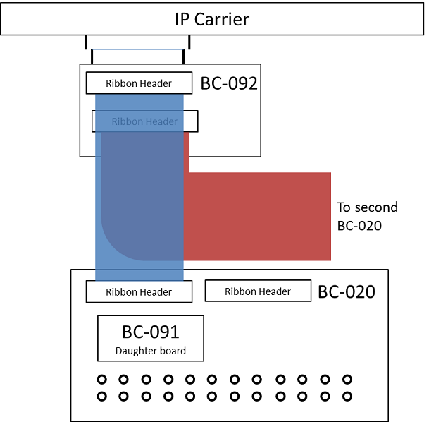
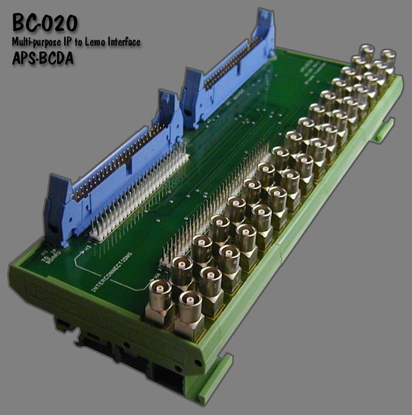
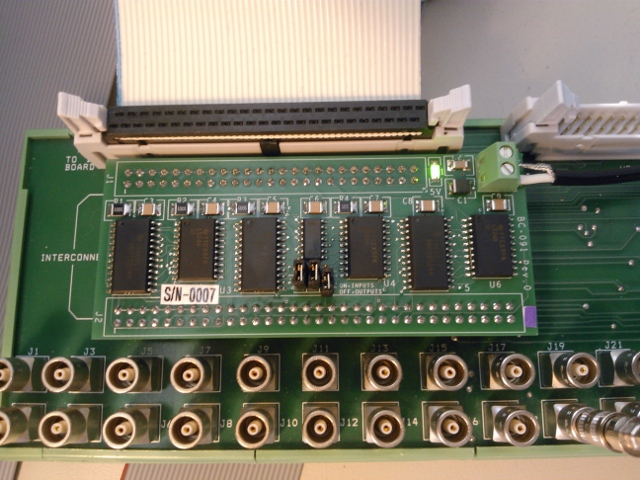
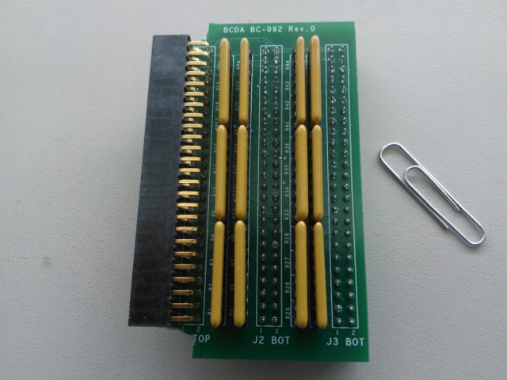
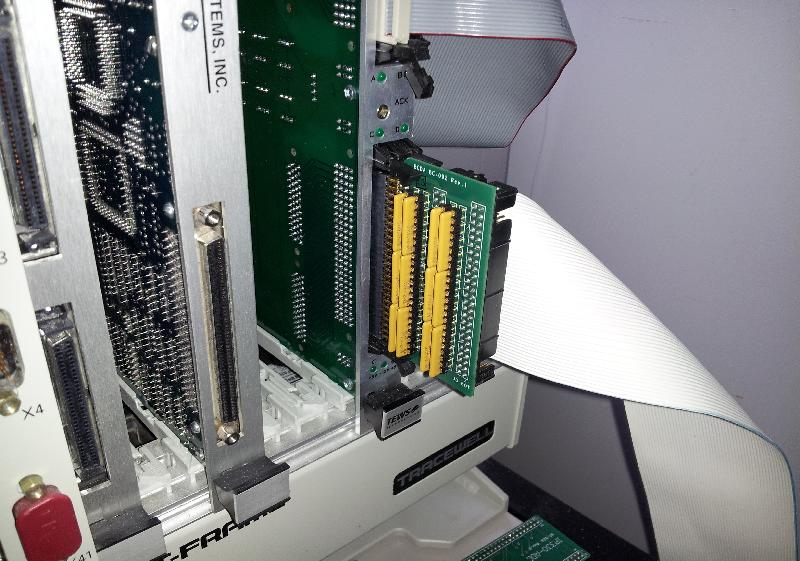
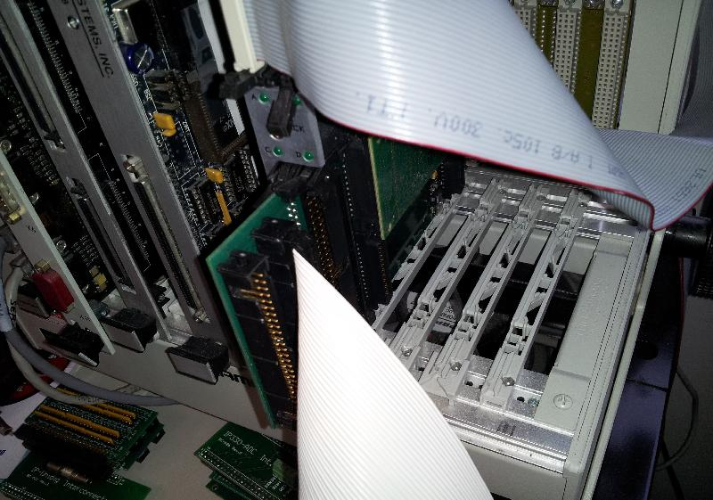

# softGlue User Guide
{: .no_toc}

## Table of contents
{: .no_toc .text-delta }

- TOC
{:toc}

## Installation and deployment

softGlue is a synApps module, so if you've used any other synApps
module, you probably already know how to install and deploy it.
The important thing is that softGlue is pure support: you are not
expected to run an IOC directly with it, but instead to draw from
the module into your own IOC application.

{: .note }
> Unlike most other synApps modules, softGlue publishes the text
> files needed to boot an IOC in its `db` directory (as an EPICS
> module really should), rather than in the `softGlueApp/Db`
> directory.

### How to get the software

softGlue is available as part of synApps 5.5 and higher, or
from the [softGlue GitHub repository](https://github.com/epics-modules/softGlue).

### Building softGlue

1. Edit `softGlue/configure/RELEASE` to specify the paths to
   `EPICS_BASE`, `ASYN`, and `IPAC`.

2. If you're using a version of ipac older than 2.11, edit
   `softGlueApp/src/drvIP_EP201.c` to change the definition of
   the macro `DO_IPMODULE_CHECK`:

   ```c
   #define DO_IPMODULE_CHECK 0
   ```

3. Run `make` in the top-level directory, using the same `make`
   executable used to build EPICS base.

{: .note }
> The build will issue a warning that it can't expand all macros
> in substitution files. This is not an error; unexpanded macros
> are intended to be defined at boot time. Note that version 1-4
> of `msi` returns an error, which causes the softGlue build to
> fail, after writing a database file that contains unexpanded
> macros.

### Deploying softGlue to an IOC

To configure an EPICS IOC application to use softGlue, you must
make modifications in the following directories, and then rebuild
the application.

**`configure/RELEASE`** -- Edit the `RELEASE` file to define the
following names:

```
SOFTGLUE=<path to the softGlue module>
ASYN=<path to the asyn module>
IPAC=<path to the ipac module>
BUSY=<path to the busy module>
```

`BUSY` is an optional add-on for use with softGlue. If the busy
module is available, you can arrange for EPICS database processing
to wait for a signal from softGlue hardware before declaring
itself to be finished. The `softGlue_convenience.db` database
loads busy records for this purpose, and the
`softGlueConvenience.adl` display file contains menu items to
display the records. Nothing else in softGlue depends on the
busy module.

**`xxxApp/src`** -- Edit `Makefile` or a `*Include.dbd` file so
that `softGlueSupport.dbd` is included in the `.dbd` file the
IOC loads at boot time. You'll also need files from asyn, ipac,
and busy, if you're not already including them.

For a Makefile:

```
iocxxx_DBD_vxWorks += softGlueSupport.dbd drvIpac.dbd asyn.dbd busySupport.dbd
```

For the `.dbd` file that will be loaded into a vxWorks IOC:

```
include "softGlueSupport.dbd"
include "drvIpac.dbd"
include "asyn.dbd"
include "busySupport.dbd"
```

Edit `Makefile` so that the IOC executable is linked with the
`softGlue` library. You'll also need libraries from the asyn,
ipac, and busy modules. The order in which libraries are named
is sometimes important. Example:

```
xxx_LIBS_vxWorks += asyn Ipac softGlue busy
```

**`iocBoot/iocxxx`** -- Copy
`softGlue/iocBoot/iocSoftGlue/softGlue.cmd` to your IOC
directory (`iocBoot/iocxxx`), and edit the `dbLoadRecords()`
commands in your copy of `softGlue.cmd` to define the macro
`P`, so that it's unique to your IOC.

{: .note }
> If you'll have more than one IP_EP20x module in an IOC, you'll
> also need to maintain separate definitions for the macro `H`,
> for asyn port names associated with the modules, and for the
> macro `READEVENT`. Port names are supplied as arguments to the
> functions `initIP_EP200()`, `initIP_EP201()`, and
> `initIP_EP201SingleRegisterPort()`, and they are supplied as
> the macro definitions `PORT`, `PORT1`, `PORT2`, and `PORT3` in
> `dbLoadRecords()` commands.

{: .important }
> If you specify the same value of `READEVENT` for N instances of
> softGlue in a single IOC, the software will still work, but it
> will use N times the CPU cycles, as each instance will post read
> events that will cause all other instances to read from the
> hardware.

Add the following line to `st.cmd`, before the call to
`iocInit()`:

```
< softGlue.cmd
```

If you use autosave, add the following line to
`save_restore.cmd`:

```
set_requestfile_path(softglue, "softGlueApp/Db")
```

{: .warning }
> The first argument `softglue` must be all lowercase, because
> this is how the path variable is defined in `cdCommands`.

Add the following line to `auto_settings.req` (or whatever you've
named the file used to save/restore PVs of arbitrary type):

```
file softGlue_settings.req  P=$(P) H=softGlue:
```

where the macros `P` and `H` agree with those in `softGlue.cmd`.

**`xxxApp/op/adl`** -- If you use MEDM, add a related-display
button to call up the `softGlueMenu.adl` display with the macros
`P` and `H`, as defined in `iocBoot/iocxxx/softGlue.cmd`. The
file `softGlueApp/op/adl/softGlueTop.adl` contains an example
button.

{: .note }
> If you figure out how to use softGlue with some other display
> manager, please tell us about it, so we can include your work
> in the next version of softGlue. The MEDM-display files
> included in softGlue make heavy use of MEDM's `composite file`,
> and other display managers may not have a comparable feature.
> softGlue's use of `composite file` is purely a
> display-development convenience.

If you use MEDM, give it access to the softGlue module's `.adl`
files. In csh, you could do this with the following command:

```
setenv EPICS_DISPLAY_PATH $EPICS_DISPLAY_PATH':'$SOFTGLUE/softGlueApp/op/adl
```

Don't forget to rebuild your application:

```
cd <applicationTop>
make rebuild
```

### Configuring hardware

The IP-EP20x board must be configured to permit programming the
FPGA via the IndustryPack bus, by moving the DIP jumper to
"IP BUS". This is the factory default setting.

### Configuring softGlue

softGlue is configured by editing `softGlue.cmd`. This file
contains calls to the user callable functions described below,
and `dbLoadRecords()` commands that load the databases matching
the FPGA content.

### User callable functions

The following functions are called from `softGlue.cmd` (or from
`st.cmd`) to initialize the IP-EP20x module and softGlue support.

**`initIP_EP200_FPGA`**

```
initIP_EP200_FPGA(ushort carrier, ushort slot, char *filename)
    carrier:  IP-carrier number (numbering begins at 0)
    slot:     IP-slot number (numbering begins at 0)
    filename: Name of the FPGA-content hex file to load into
              the FPGA.

Example:
    initIP_EP200_FPGA(0, 2, "$(SOFTGLUE)/softGlueApp/Db/SoftGlue_2_2.hex")
```

Write content to the FPGA. This command will fail if the FPGA
already has content loaded, as it will after a soft reboot. When
the command fails for this reason, the already loaded FPGA content
will be left as it was, with no ill effect. To load new FPGA
content, you must power cycle the IOC.

**`initIP_EP200`**

```
initIP_EP200(ushort carrier, ushort slot, char *portName1,
    char *portName2, char *portName3, int sopcBase)
    carrier:   IP-carrier number (numbering begins at 0)
    slot:      IP-slot number (numbering begins at 0)
    portName1: Name of asyn port for component at sopcBase
    portName2: Name of asyn port for component at sopcBase+0x10
    portName3: Name of asyn port for component at sopcBase+0x20
    sopcBase:  must agree with FPGA content (0x800000)

Example:
    initIP_EP200(0, 2, "SGIO_1", "SGIO_2", "SGIO_3", 0x800000)
```

Initialize basic field I/O.

**`initIP_EP200_Int`**

```
initIP_EP200_Int(ushort carrier, ushort slot, int intVectorBase,
    int risingMaskMS, int risingMaskLS,
    int fallingMaskMS, int fallingMaskLS)
    carrier:       IP-carrier number (numbering begins at 0)
    slot:          IP-slot number (numbering begins at 0)
    intVectorBase: must agree with the FPGA content loaded
                   (0x90 for softGlue 2.1 and higher;
                    0x80 for softGlue 2.0 and lower).
                   softGlue uses three vectors, for example,
                   0x90, 0x91, 0x92.
    risingMaskMS:  interrupt on 0->1 for I/O pins 33-48
    risingMaskLS:  interrupt on 0->1 for I/O pins 1-32
    fallingMaskMS: interrupt on 1->0 for I/O pins 33-48
    fallingMaskLS: interrupt on 1->0 for I/O pins 1-32

Example:
    initIP_EP200_Int(0, 2, 0x90, 0x0, 0x0, 0x0, 0x0)
```

Initialize field-I/O interrupt support.

{: .important }
> Interrupt vectors are hardwired in the supplied FPGA content.
> Each IP-EP20x module uses three vectors (0x90, 0x91, 0x92),
> one for each set of 16 I/O bits. Depending on the
> interrupt-service mechanism supported by the operating system,
> multiple IP-EP20x boards may or may not all be able to generate
> interrupts. For PowerPC processors, interrupt-service routines
> (ISRs) are chained, so multiple IP-EP20x modules can all
> generate interrupts. But if the operating system doesn't permit
> multiple ISRs attached to a single interrupt vector, then only
> one IP-EP20x board will be able to generate interrupts. See
> "Field I/O Interrupt support" in the User interface section for
> a description of the `softGlueFieldIO_Intxx.adl` display.

**`initIP_EP200_IO`**

```
initIP_EP200_IO(ushort carrier, ushort slot,
    ushort moduleType, ushort dataDir)
    carrier:    IP-carrier number (numbering begins at 0)
    slot:       IP-slot number (numbering begins at 0)
    moduleType: one of [201, 202, 203, 204]
    dataDir:    Bit mask, in which only the first 9 bits are
                significant.  If a bit is set, the corresponding
                field I/O pins are outputs.  Note that for the
                202 and 204 modules, all I/O is differential,
                and I/O pin N is paired with pin N+1.  For the
                203 module, pins 25/26 through 47/48 are
                differential pairs.
```

Correspondence between `dataDir` bits (0-8) and I/O pins (1-48):

| dataDir bit | 201 | 202 or 204 | 203 |
| - | - | - | - |
| bit 0 | pins 1-8 | pins 1, 3,25,27 | pins 25,27 |
| bit 1 | pins 9-16 | pins 5, 7,29,31 | pins 29,31 |
| bit 2 | pins 17-24 | pins 9,11,33,35 | pins 33,35 |
| bit 3 | pins 25-32 | pins 13,15,37,39 | pins 37,39 |
| bit 4 | pins 33-40 | pins 17,19,41,43 | pins 41,43 |
| bit 5 | pins 41-48 | pins 21,23,45,47 | pins 45,47 |
| bit 6 | x | x | pins 1-8 |
| bit 7 | x | x | pins 9-16 |
| bit 8 | x | x | pins 17-24 |

Examples:

1. For the IP-EP201, `moduleType` is 201, and `dataDir == 0x3c`
   would mean that I/O bits 17-48 are outputs.
2. For the IP-EP202 or IP-EP204, `moduleType` is 202 or 204, and
   `dataDir == 0x13` would mean that I/O bits
   1,3,25,27, 5,7,29,31, 17,19,41,43 are outputs.
3. For the IP-EP203, `moduleType` is 203, and `dataDir == 0x???`
   would mean that I/O bits 1-8, 25,27, 29,31, 33,35, 45,47 are
   outputs.

Set field-I/O data direction:

```
initIP_EP200_IO(0, 2, 201, 0x3c)
```

**`initIP_EP201`**

For backward compatibility with softGlue 2.1 and earlier, the
following command can be used to initialize an IP_EP201 module,
instead of the above calls to `initIP_EP200()`,
`initIP_EP200_Int()`, and `initIP_EP200_IO()`. This won't work
for any other IP_EP200-series module.

```
initIP_EP201(char *portName, ushort carrier, ushort slot,
    int msecPoll, int dataDir, int sopcOffset,
    int interruptVector, int risingMask, int fallingMask)
    portName:        Name of asyn port for component at
                     sopcOffset
    carrier:         IP-carrier number (numbering begins at 0)
    slot:            IP-slot number (numbering begins at 0)
    msecPoll:        Time interval between driver polls of
                     field I/O bits
    dataDir:         Data direction for I/O bits, explained
                     below.
    sopcOffset:      SOPC offset (must be as in example below).
    interruptVector: Must agree with the FPGA content loaded
                     (0x90, 0x91, 0x92 for softGlue 2.1 and
                     higher; 0x80, 0x81, 0x82 for softGlue 2.0
                     and lower).
    risingMask:      16-bit mask: if a bit is 1, the
                     corresponding I/O bit will generate an
                     interrupt when its value goes from 0 to 1.
                     Bit 0 corresponds to field I/O pin 1,
                     bit 1 to pin 2, etc.
    fallingMask:     Similar to risingMask, but for 1-to-0
                     transitions.

                     Note that the user can overwrite risingMask
                     and fallingMask at run time, with menu
                     selections, and probably has those
                     selections autosaved.
```

`dataDir` is a bit mask in which only bits 0 and 8 are
significant:

- For `sopcOffset` 0x800000:
  - If bit 0 of `dataDir` is set, I/O bits 1-8 are outputs.
  - If bit 8 of `dataDir` is set, I/O bits 9-16 are outputs.
- For `sopcOffset` 0x800010:
  - If bit 0 of `dataDir` is set, I/O bits 17-24 are outputs.
  - If bit 8 of `dataDir` is set, I/O bits 25-32 are outputs.
- For `sopcOffset` 0x800020:
  - If bit 0 of `dataDir` is set, I/O bits 33-40 are outputs.
  - If bit 8 of `dataDir` is set, I/O bits 41-48 are outputs.

Example:

```
initIP_EP201("SGIO_1",0,2,1000000,0x101,0x800000,0x90,0x00,0x00)
initIP_EP201("SGIO_2",0,2,1000000,0x101,0x800010,0x91,0x00,0x00)
initIP_EP201("SGIO_3",0,2,1000000,0x101,0x800020,0x92,0x00,0x00)
```

{: .note }
> Interrupt vectors are currently hardwired in the supplied FPGA
> content. Thus, if you want to use two or more IP_EP20x modules,
> only one may be permitted to generate interrupts. Interrupt
> generation is entirely an end-user choice, and it occurs only
> for the purpose of causing some EPICS record to process on the
> change of state of a softGlue field I/O signal. See "Field I/O
> Interrupt support" below for a description of the
> `softGlueFieldIO_Intxx.adl` display.

**`initIP_EP201SingleRegisterPort`**

```
initIP_EP201SingleRegisterPort(char *portName,
    ushort carrier, ushort slot)
```

Initialize softGlue signal-name support.

Example:

```
initIP_EP201SingleRegisterPort("SOFTGLUE", 0, 2)
```

## User interface

Most of the essential user-interface information -- how to connect
signals, what the display elements mean, etc. -- is contained in
the descriptions of the "User Menu" and "AND" sections below. The
remaining sections are mostly for completeness, though some
circuit elements do require further explanation, and the counter
sections introduce new display elements for registers containing
decimal numbers.

We're going to have a little trouble with the meanings of "input"
and "output", because they imply a viewpoint, and because we're
going to be taking three different viewpoints: those of EPICS
records, circuit elements, and field-wiring connectors. Usually,
in EPICS, we think of an output as something to which an EPICS
record can write, but that definition would be awkward here,
because it would eventually require us, for example, to refer to
the output of an AND gate as an "input". You just can't discuss
digital circuitry intelligibly from that viewpoint.

Therefore, in this documentation, "input" and "output" will
normally be from the viewpoint of one of the circuit elements
we'll be wiring. Field I/O will be an exception, because it's
most conveniently discussed from the viewpoint of the field-wiring
connector.

### User menu


`softGlueMenu.adl` is the top softGlue display, which serves
mostly to call up other displays. The menu labelled `READ PERIOD`
specifies the period at which the values of all signals are
sampled for display to the user.

{: .note }
> Most softGlue displays are not interrupt driven. (That would be
> a disaster, because inevitably some signals will change state at
> high frequency.) So, the states of inputs and outputs must be
> sampled periodically, for display to the user. Polling
> everything at 0.1 second uses only a few percent of an MVME2700
> CPU, and we've found that it's confusing for users if the poll
> period is greater than around 1 second.

### AND


On the left of the AND gate are the inputs, each comprised of a
blue `=` button, a yellow text-entry field, a number, and what's
intended to look like a red LED. On the right are essentially
the same things in reverse order, but an output's text-entry
field is a different color. The text-entry fields are used to
connect signals together, and the color difference is intended
to remind you of the only rule governing signal connections: if
you connect two or more outputs together, those outputs won't
work.

{: .note }
> softGlue outputs are engineered to ensure that you can't break
> anything by connecting outputs together, but the circuit won't
> be useful until you fix the error, because the states of outputs
> connected together are undefined. Currently, softGlue doesn't
> signal this error by putting offenders into an alarm state.

The yellow text-entry box controls an input. You have three
options:

1. **Leave empty.** Inputs with empty text-entry boxes default
   to logic value 1.

2. **Enter a string that begins with a number.** This directly
   writes a logic value (optionally, a pulse) to the input.

   softGlue will parse everything that looks numberish, and
   convert to a floating point value. This sets the input to a
   logic value: 0 if the nearest integer to the converted value
   is zero, 1 if it's not.

   {: .note }
   > Allowing floats, and extra characters after the number,
   > makes it easier to drive softGlue inputs with calcout
   > records, replies from serial devices, etc.

   The strings `0!` and `1!` (possibly followed by other ignored
   characters) direct softGlue to write a pair of logic values:
   `0!` writes `0` followed immediately by `1`; `1!` writes `1`
   followed immediately by `0`. The time interval between writes
   is system dependent, and not at all guaranteed, but it should
   be much smaller than the interval you could achieve from
   separate writes. On an MVME2700, the interval is around 6 us.

3. **Enter a string that begins with something other than a
   number.** This *names* the signal, and connects it to all
   other signals with the same name (or with the same name
   followed by `*`, as described below). Case is significant in
   comparing signal names.

Note that a "signal", as the word is used in this documentation,
is a named connection between softGlue circuit elements. It might
be more intuitive to think of a "signal" as a wire, to avoid
confusing it with, say, field I/O.

{: .important }
> If you're using more than one IP-EP20x module, you can't
> connect signals implemented in different IP-EP20x modules using
> their text-entry boxes. To accomplish this, you must connect the
> signals to field I/O and make a physical connection.

If you want to use the inverted value of a signal for input to
some component, append `*` to the signal name. This doesn't
change the signal that the input is connected to, but just tells
softGlue to run the signal through an inverter before applying it
to the input. Note that output signal names may not end with `*`.

In MEDM, you can use Drag-And-Drop to connect a named signal to
some other signal. When you drop, MEDM will put the PV name of
the signal you dragged from. When you press `Enter`, softGlue's
device support will write the signal name of the source PV to the
destination PV.

In caQtDM, you can select the text of a signal name, and use
Copy/Paste (Ctrl-C/Ctrl-V) to copy the signal name from one
text-entry box to another.

Whatever option you choose, you can define at most fifteen
different signal names. When you try to define the 16th name,
softGlue will erase whatever you wrote, and put the record into
the "INVALID" alarm state. (But note, for example, that `reset`
and `reset*` are not different signal names, because the trailing
`*` is not regarded as part of the name; it merely describes how
the signal should be used.)

Text-entry boxes for output signals won't accept names beginning
with a number, or ending with `*`. (softGlue will simply strip
the offending characters, and leave the rest.)

{: .note }
> A signal name beginning with a number can only be a direct-write
> command; it cannot connect things together, because the leading
> number would be misinterpreted by input-signal-name parsing as a
> direct-write command. Output-signal names ending with `*` are
> logically sensible, but are not permitted; this simplifies the
> implementation of `*` appended to input-signal names.

A signal's blue `=` button is used to find all other signals to
which the signal is connected. While a signal's `=` button is
pressed, input signals connected to it are bordered in green, and
output signals connected to it are bordered in orange. If you
ever see two or more orange borders at the same time, you have
outputs connected together, and your circuit won't work.

The little red and black filled circles (LEDs), and the numbers
next to them, display the states of their signals. These display
elements are updated at the period specified in the
`softGlueMenu.adl` display. If you want the EPICS PV name
corresponding to a signal's logic value, this is the PV name to
use.

For completeness, here's the truth table for an AND gate:

| input1 | input2 | output |
| - | - | - |
| 0 | x | 0 |
| x | 0 | 0 |
| 1 | 1 | 1 |

*`x` means "either 0 or 1".*

### OR


| input1 | input2 | output |
| - | - | - |
| 0 | 0 | 0 |
| 1 | x | 1 |
| x | 1 | 1 |

### Buffer


The purpose of the buffer element is to permit EPICS to drive
several softGlue inputs by writing to a single PV, without
using up a more valuable circuit element, such as the XOR gate.

### Inverting buffer


There is no inverting buffer -- or any other inverting gate -- in
softGlue. Signal inversion is accomplished by appending `*` to
the name of a signal used as input to any logic element, as
demonstrated above for the buffer element. Note that `*` appended
to the name of an output signal will be removed.

### XOR


| input1 | input2 | output |
| - | - | - |
| 0 | 0 | 0 |
| 0 | 1 | 1 |
| 1 | 0 | 1 |
| 1 | 1 | 0 |

### D flip-flop


The input signal labelled `>` is the "clock" input. Unlike other
signals, clock inputs are edge sensitive. All clock inputs in
softGlue act on the rising edge of the input signal.

The open circle ("bubble") in the `SET` and `CLEAR` inputs'
signal paths indicate that these signals are inverted before
being used. Thus, applying `0` to the `CLEAR` input causes the
output to be "cleared" (given the value 0).

| SET | CLEAR | D | `>` (clock) | Q |
| - | - | - | - | - |
| 0 | 0 | x | x | undefined |
| 0 | 1 | x | x | 1 |
| 1 | 0 | x | x | 0 |
| 1 | 1 | any | rising edge | D_BEFORE (value D had immediately before the rising edge of the clock signal) |

### 2-input multiplexer


When `SEL==0`, `OUT=IN0`. When `SEL==1`, `OUT=IN1`.

### 2-output demultiplexer


When `SEL==0`, `OUT0=IN`, and `OUT1` is undefined (currently 0).
When `SEL==1`, `OUT1=IN`, and `OUT0` is undefined (currently 0).

### Up counter


`EN==1` enables the clock (`>`) input, whose rising edge
increments the counter value.

### Down counter


`EN==1` enables the clock (`>`) input, whose rising edge
decrements the counter value. When `LOAD==1` the counter is
loaded with the value applied to the `PRESET` input. While
`LOAD==1`, the counter does not count down. While `LOAD==0` and
`EN==1`, a rising edge at the clock input decrements the counter.
When the counter value reaches `0`, the output `Q` goes to `1`;
the next rising edge of the clock returns `Q` to `0` (regardless
of the states of `EN` and `LOAD`).

### 32-bit divide by N


`EN==1` enables the clock (`>`) input. Every `N`th rising edge
of the clock drives `Q` to `1`. The next rising edge returns `Q`
to `0`. This behavior produces the correct number of rising edges
of the output signal, but it does not guarantee the same number
of falling edges. Therefore, using an inverted copy of the output
to clock downstream electronics will in some cases have
inconsistent results. When `N==0`, the divide circuitry is
bypassed, and the clock is connected directly to `Q`. This is an
error; the output should still be gated by the `EN` signal.

In softGlue version 2.1 and earlier, the `RESET` signal doesn't
do anything. Beginning with softGlue 2.2, the `RESET` signal
loads the counter with `N`, so that `Q` will be driven to `1`
after `N` rising edges of the clock. `RESET` does not clear the
output `Q`. If `Q` is `1`, it will be cleared on the first rising
edge of the clock.

### 8 MHz internal clock


An 8 MHz clock derived from the IndustryPack clock is available
to softGlue circuitry as a free standing output.

### Field I/O


This display allows you to connect field I/O signals to each
other and to softGlue circuits. Note that a "Field Input Bit"
looks like and behaves as a softGlue *output*, because what
you're actually controlling is the output of a buffer driven by
the field-input signal. Similarly, a "Field Output Bit" looks
like and behaves as a softGlue *input*, because you're actually
controlling the input of a buffer that drives the field-output
signal.

The signals in this display are the field inputs or outputs
connected to pins 1-16, 17-32, or 33-48 on the IP-EP201's
ribbon connector. The IP-EP201 board supports 48 I/O bits, and
permits them to be set for input or output in groups of 8.

`POLL TIME (MS)` specifies the period at which softGlue reads
the I/O ports for user-display purposes, and for executing the
EPICS link associated with non-interrupt-enabled I/O bits (see
next section). If an I/O bit has changed value since the last
read, softGlue processes the display record associated with that
bit, so the user will see the new value. If an I/O bit is enabled
to generate interrupts, as described in the next section, the bit
will be read immediately by the interrupt handler, so `POLL TIME`
will not matter for that bit.

If you have a field input connected to an FPGA component, the
component will react to a change in the input value within
nanoseconds. I/O polling is not involved at all in the logic
connection.

{: .note }
> You can change the `CONNECTOR #` strings in this display -- for
> example, to support a custom signal-breakout module, or to give
> the I/O signals application-specific names. The strings are
> defined in `softGlueApp/Db/softGlue_FPGAContent.substitutions`,
> as the macro `IOPIN` supplied to `softGlue_FieldOutput.db` and
> `softGlue_FieldInput.db`. In softGlue 2.3.1, field I/O displays
> leave room for longer strings, and there is an autosave-request
> file for these PVs.

During a VME power cycle, and during a VME reset, field outputs
are first put into a high impedance state, then are driven to
ground, and finally are driven to values controlled by the user
circuit. If user-circuit field-outputs are autosaved, they will be
restored during the boot; otherwise, they will default to logic 1
(+5V for TTL).

During a soft reboot (that is, when the vxWorks `reboot` command
is given in the IOC console), field outputs will maintain their
values.

### Field I/O interrupt support


Field-input lines supported by softGlue can generate interrupts
on rising edges, falling edges, both, or neither. You control
this by setting the `INTERRUPT ENABLE` menu to `Rising`,
`Falling`, `Both`, or `None`, respectively. Field output lines
can also generate interrupts: if a bit is designated as an output,
the output is connected also to the input, and to the input's
interrupt-generation circuitry.

Interrupts are throttled by softGlue's interrupt handler. If more
than four interrupts have occurred and not been handled, softGlue
will disable interrupts from the offending bit, by setting the
bit's `INTERRUPT ENABLE` menu to `None`, and it will direct your
attention to the change by drawing a red box around the menu
control. The box will be erased the next time the menu is written
to.

{: .note }
> The number of unhandled interrupts that triggers throttling is
> adjustable by modifying `drvIP_EP201.c`. You must change the
> definition of `MAX_IRQ`, and you must also ensure that the asyn
> ring buffers for interrupt driven PVs is larger than `MAX_IRQ`.
> (The default ring buffer size is 10. Asyn documentation
> describes how to change it.)

When an interrupt occurs, you can have the signal value written to
an EPICS PV, by writing an EPICS link description into the purple
box labelled "ON INTERRUPT, WRITE SIGNAL VALUE VIA THIS LINK", as
shown for input 16 in the above screen shot.

*For interrupts that may occur too closely spaced in time for
softGlue's normal interrupt-response mechanism to handle
reliably, see "Custom interrupt handlers" below.*

#### About EPICS links

In softGlue displays (and in most other synApps displays),
standard EPICS links are displayed as purple text-entry boxes, in
which you describe the link you want to make. For purposes here,
an EPICS link description is the name of an EPICS PV, followed by
one of the following link attributes:

| Attribute | Description |
| - | - |
| NPP | (default) Write value, but do not cause processing. |
| PP | Write value and cause processing (if the record containing the PV is "Process Passive", which means that its SCAN field has the value "Passive"). You should use this attribute unless you have some reason not to. |
| CA | Write value and let the record containing the PV decide whether or not to process. |

{: .note }
> EPICS will tack on the string " NMS". This alarm-propagation
> attribute is not something end users need to worry about.

For example, to cause a link to write effectively to the top
input of the first AND gate (whose PV name is
`xxx:softGlue:AND-1_IN1_Signal`), you would write the following
into a purple box:

```
xxx:softGlue:AND-1_IN1_Signal PP
```

If you only write the PV name, EPICS will supply the link
attribute `NPP`, and your link will write a value, but the value
won't have any effect until the next time the record processes.
(For most PVs in softGlue, the value written by an NPP link
won't even be displayed until the record processes.)

If the link writes to a PV in a different IOC, the specified link
attribute will be ignored, and the attribute `CA` will be used
instead.

### All components display


Everything on one display, with the signal named "clock"
highlighted so that all of its connections are evident. A signal
name gets this treatment when the `=` button next to an input or
output is pressed. Note that connections to inputs are bordered in
green, and connections to outputs are bordered in orange.

This display shows everything in softGlue except interrupt
support.

### Convenience


This display controls two pulse generators implemented in EPICS,
with links allowing them to write to a softGlue input (that is,
to a yellow box), and, similarly, two clock generators implemented
in EPICS. The display also has MEDM related-display callups for
two busy records.

The use of EPICS links (the purple boxes in the above display) is
described above in the section "About EPICS links", in the
documentation of "Field I/O interrupt support".

### Busy record


This display controls the value, output link, and forward link of
a busy record. In the anticipated use with softGlue, one would
have some EPICS record outside of softGlue set the busy record to
"Busy" (using a PP link), and arrange for a softGlue interrupt
bit (see "Field I/O interrupt support" above) to use its
EPICS-output link to clear the busy record to "Done" (using a CA
link).

{: .important }
> It's important to **set** a busy record to "Busy" using a PP
> link, because the purpose of a busy record is to represent some
> external processing as EPICS processing. This allows EPICS'
> execution tracing to signal the completion of the processing.
> EPICS only traces processing started or propagated with a PP
> link. It's important to **clear** a busy record to "Done" with
> a CA link, because an EPICS PP link will decline to process any
> record that is already processing. The busy record is written
> so that a CA put will succeed in clearing it and causing its
> processing to appear done to EPICS.

## Add-on FPGA components

The following components are not in the standard softGlue
package, but in add-on packages typically made to solve specific
problems.

### 32-bit up/down counter


`EN==1` enables the clock (`>`) input. `CLEAR==1` sets the
current count and the output value `Q` to zero. When
`UP/DOWN==1` the counter counts up. `LOAD` sets the current
count to `PRESET`.

### Quadrature decoder


This circuit converts a pair of digital quadrature signals `A`,
`B` (for example, signals from an encoder) into a pair of `STEP`,
`DIR` signals. `A` and `B` are sampled on rising edges of the
`CLOCK` signal. If either have changed since the last rising
edge, the travel direction implied by the change is output to
`DIR`, and a pulse is output to `STEP`. The pulse width is equal
to the period of the `CLOCK` signal, and the input frequency may
not be greater than half the clock frequency.

### Shift register


This circuit converts from parallel to serial, or from serial to
parallel.

For parallel-to-serial conversion, a number is written into the
`LOADVAL` register, and loaded by a positive-going pulse to the
`LOAD` input. On each rising edge of the clock input `>`, the
loaded value is shifted toward the most significant bit, and the
most significant bit is output to the Q output.

For serial-to-parallel conversion, the input `D` is sampled on
the rising edge of the clock input, and that value is shifted
into the least significant bit of the register.

### Four-output demultiplexer


When `SEL0==0` and `SEL1==0`, `OUT0=IN`, and other OUTs are
undefined (currently 0).

When `SEL0==1` and `SEL1==0`, `OUT1=IN`, and other OUTs are
undefined (currently 0).

When `SEL0==0` and `SEL1==1`, `OUT2=IN`, and other OUTs are
undefined (currently 0).

When `SEL0==1` and `SEL1==1`, `OUT3=IN`, and other OUTs are
undefined (currently 0).

There are two copies of this add-on component:

1. `SoftGlue_2_2_demux4.hex` -- the basic component, with all
   inputs and outputs routed to signal names, as usual for
   softGlue.
2. `SoftGlue_2_2_demux4_HW.hex` -- the same component, but with
   multiplexer outputs routed to signal names, as usual, and also
   hardwired to the last 16 field I/O pins. Thus,
   `DEMUX4-1_OUT0` is connected to pin 33, `DEMUX4-1_OUT1` is
   connected to pin 34, ..., and `DEMUX4-4_OUT3` is connected to
   pin 48.

### Encoder time average circuit


This circuit is for general encoder support, and also for
generating a time averaged value of an encoder signal. Up/Down
counters 1-4 are copies of the 32-bit Up/Down counter described
above. Up/Down counter 5 is also a 32-bit Up/Down counter, but
it has no `Q` output. Instead, it has `Q8` and `C8` outputs. `Q8`
is true whenever the 8 least significant bits are all zero. `C8`
is a ripple carry bit, which allows the eight least significant
bits of this counter to be combined with any 32-bit counter to
make a 40-bit counter.

MagCmp-1 is a 32-bit magnitude comparator, which produces the
signals `A>B` and `A!=B` on the rising edge of the clock
`SAMPLE`. The component also produces the signals `BCLOCK` and
`BDIR` with the following circuitry, which uses the `Q8` signal
from Up/Down counter 5:


## Saving and restoring circuits

softGlue circuits can be saved and restored using
[autosave](https://epics-modules.github.io/autosave/),
autosave's *configMenu* facility,
[BURT](http://www.aps.anl.gov/epics/extensions/burt/index.php),
or any channel access client that can read and write PVs.
configMenu is particularly handy, because it's driven by EPICS
PVs, and because it saves a time-stamped backup copy of every
file it overwrites. Whichever method you use, you may need to
clear softGlue signal names before loading a circuit, because
loading over an existing circuit could temporarily exceed the
available number of signal names. (Alternatively, you could
simply load twice, and be confident that the second load will
succeed.)

### Using autosave's configMenu


If you have autosave R5-1 or higher, you can use configMenu to
save and restore circuits. Here are the steps needed to implement
a menu of softGlue circuits, and to give the user a GUI display
for saving and restoring them. (In the following, `SG` is the
name of this instance of configMenu. The files it loads and saves
will be named `SG_<config Name>.cfg`. For example, the configMenu
instance pictured above has files named `SG_clear.cfg`,
`SG_encoderTest.cfg`, etc.)

1. In the IOC's startup directory, create an autosave request
   file, which I'll call `SGMenu.req`, with the following
   content:

   ```
   file configMenu.req P=$(P),CONFIG=$(CONFIG)
   file softGlue_settings.req  P=$(P),H=$(H)
   ```

2. Uncomment the following line in the IOC's copy of
   `softGlue.cmd`:

   ```
   dbLoadRecords("$(AUTOSAVE)/asApp/Db/configMenu.db","P=xxx:,CONFIG=SG")
   ```

3. Add the following line to `st.cmd`:

   ```
   create_manual_set("SGMenu.req","P=xxx:,CONFIG=SG")
   ```

4. Add an MEDM related-display entry to bring up the
   `configMenu.adl` display:

   ```
   label="SGMenu" name="configMenu.adl" args="P=xxx:,CONFIG=SG"
   ```

softGlue includes configMenu files (`*.cfg`) for standard example
circuits in the `iocBoot/iocSoftGlue` directory. In actual use,
these `.cfg` files would be placed in your application's
`iocBoot/iocxxx/autosave` directory. For more information on
configMenu, see the autosave documentation.

### Using BURT

The BURT request file `softGlueApp/op/burt/softGlue.snap` can be
used to save all softGlue user modifiable PVs. For example, the
following command saves the state of softGlue to the file
`myCircuit.snap`:

```
burtrb -f softGlue.req -DPREFIX=xxx:softGlue -o myCircuit.snap
```

{: .important }
> `-f softGlue.req` specifies that the request file
> `softGlue.req` should be used to specify the EPICS PVs whose
> values are to be saved. This file contains lines like
> `PREFIX:AND-1_IN1_Signal`, where `PREFIX` is to be replaced by
> text specific to your IOC. `-DPREFIX=xxx:softGlue` specifies
> that `PREFIX` is to be replaced by `xxx:softGlue`.
> `-o myCircuit.snap` specifies that the saved PV names and
> values are to be written to the snapshot file
> `myCircuit.snap`. No doubt your PREFIX will be different from
> mine, but it should be `$(P)$(H)` from your copy of
> `softGlue.cmd`, minus the trailing `:` from `$(H)`. BURT needs
> the `:` to separate "PREFIX" from the rest of the PV names it
> parses. If you defined `H` without a trailing `:`, you'll need
> to make some adjustment to satisfy BURT.

The following commands restore the circuit:

```
burtwb -f clearAll.snap
```

```
burtwb -f myCircuit.snap
```

The first command is often needed because there is a limit to the
number of signal names that softGlue will accept. If you neglect
to clear all signals before restoring a circuit, the allowed
number of signal names might be exceeded during the restore, if
new signal names are defined before old signal names are deleted.
(Alternatively, you could simply run the second command twice.)

To restore example circuits included in the softGlue module, or
to restore a snapshot file emailed to you by some other softGlue
user, you will need to edit the snapshot file to change PV names
such as `xxx:softGlue:AND-1_IN2_Signal` to PV names in your IOC,
which might look like `1ida:softGlue:AND-1_IN2_Signal`.

## Example circuits

The following circuits have been tested and saved in BURT snapshot
files, and as configMenu `.cfg` files, as described above (see
*Saving and restoring circuits*). The snapshot files can be found
in `softGlueApp/op/burt`; the `.cfg` files are in
`iocBoot/iocSoftGlue`.

### Motor-pulse gate

Positive-going pulses can be gated with an AND gate, by applying
the signal to one input of the AND gate, and setting the other
input to `0` (deny) or `1` (allow) to control passage through the
gate. Negative-going pulses can be gated with an OR gate, by
applying the signal to one input of the OR gate, and setting the
other input to `0` (allow) or `1` (deny) to control passage
through the gate.

### Gated scaler

*Files: `softGlueApp/op/burt/gatedScaler.snap` or
`iocBoot/iocSoftGlue/gatedScaler.cfg`*

This circuit implements four counter channels, a time base to
control counting time, an overall gate, and additional circuitry
to control starting, stopping, and processing of the count-value
records. Note that the scaler is controlled by a busy record from
the softGlue convenience database, so that client software can
discover when counting is finished in the standard EPICS way. See
`softGlueApp/op/burt/gatedScaler.txt` for more details.


### Four independent pulses

*Files: `softGlueApp/op/burt/fourPulses.snap` or
`iocBoot/iocSoftGlue/fourPulses.cfg`*

This circuit produces four separate pulse signals, which start at
specified start-delay times after (the falling edge of) an initial
start pulse, and which last for specified pulse-length times. It
uses four DnCntrs to implement the start-delay times, and four
DivByNs to implement the pulse-length times. Times are specified
as multiples of the (125 ns) clock period (`PRESET` for the
DnCntrs; `N` for the DivByNs), and these numbers must be greater
than or equal to 1. The pulse sequence starts on the falling edge
of the signal `BUF-1`, written by a periodically scanned EPICS
record (one of the softGlue convenience clocks). One spare signal
name is available, however, so the pulse sequence could also be
started by an external signal.


### Motor-pulse accel/decel gate

*Files: `softGlueApp/op/burt/accelDecelGate.snap` or
`iocBoot/iocSoftGlue/accelDecelGate.cfg`*

(Non-softGlue support in
`softGlueApp/op/burt/accelDecelGate_transform.sav`.)

If you know the number of steps a stepper motor will move during
its acceleration time, you can easily arrange to deliver motor
pulses to some external circuit only while the motor is moving at
constant speed. For a stepper motor controlled by the motor
record, the number of acceleration/deceleration steps, *N_a*, can
be calculated with the following formula:

*N_a* = ((`VBAS` + `VELO`) / 2) * `ACCL` / `MRES`

where `VBAS`, `VELO`, `ACCL`, and `MRES` are motor record fields.

The number of constant-speed steps, *N_c*, is then

*N_c* = ((*VAL_end* - *VAL_start*) / `MRES`) - 2 * *N_a*

where *VAL_end* and *VAL_start* are the final and initial values
of the motor record `VAL` field.

The following circuit accepts negative-going motor pulses at
input signal 1, gates out the first 11 (the value of
`DnCntr-1_PRESET`), and from then on sends motor pulses to output
pin 17 until a total of 31 (the value of `DnCntr-2_PRESET`) have
been sent. The circuit is reset by writing `1!` (positive-going
pulse) to the input of `BUF-1`.

The circuit includes some diagnostics, and a mechanism for
testing:

- `UpCntr-1` counts all motor pulses; `UpCntr-2` counts gated
  motor pulses. Both counters are reset by the same signal that
  resets the gate circuit.
- A manual reset is implemented using `BUF-1`. Writing `1!` to
  the input of `BUF-1`, as shown, causes a short positive-going
  pulse to be applied to it, and thus to its output, the signal
  named "reset".


Down counter `DnCntr-1`, and flipflop `DFF-1`, together produce a
gate signal that is 0 after a reset, and that goes to 1 after
`DnCntr-1_PRESET` motor pulses. Down counter `DnCntr-2`, and
flipflop `DFF-2`, together produce a gate signal that is 1 after
a reset, and that goes to 0 after `DnCntr-2_PRESET` motor pulses.
We load the number of acceleration steps into
`DnCntr-1_PRESET`, and the number of acceleration steps plus
constant-speed steps into `DnCntr-2_PRESET`.

`AND-1` combines the gate signals produced above into a signal
that is 1 while the motor is moving at constant speed.

`AND-2` gates the negative-going motor pulses, using what was
described in the "Motor-pulse gate" example as a positive-going
pulse gate, by inverting the "motor" signal before applying it to
the gate.

Note that the down counters are clocked by (rising edges of)
"motor", to produce the signal used to gate `motor*`. This choice
avoids a race condition between simultaneous rising edges of
"gateOut" and "motor". (This circuit gates negative-going motor
pulses, so another way to make the point is to say that the
trailing edge of a motor pulse is used to produce a gate that will
be ready in plenty of time for the leading edge of the next motor
pulse.)

Calculations for the circuit are shown in the following screen
capture of a transform record.


## Field wiring

### IP-EP201 (TTL)

Getting clean electrical signals from the IP-EP201 out to field
wiring requires some attention to detail. The signals have short
rise times (on the order of a few ns), and the IP-EP201 pinout
places 48 of them on adjacent ribbon-cable conductors, with a
single ground conductor at one end of the ribbon. This combination
pretty much guarantees problems with crosstalk and ringing.

Firstly, sharp-edged signals produce significant crosstalk between
conductors, because the magnetic fields generated by signal
currents vary rapidly enough during changes of state to induce
significant voltages in nearby conductors. There is also the
possibility of crosstalk from the fact that return currents of all
signals share a single ground conductor. The shared-ground
contribution is small, compared to the magnetic-field-induced
contribution, but it could be significant in long (tens of feet)
ribbon cables.

Secondly, sharp-edged signals require transmission-line
termination to damp reflections at impedance mismatches. Otherwise
downstream electronics will see ringing, as current sloshes back
and forth through the cable, which can (if it exceeds the TTL
noise margin) make each transition look like two or more. But the
IP-EP201 has no termination, and its pinout results in 48 coupled
transmission lines, for which effective termination is probably
not possible.

Nevertheless, it's possible to get clean signals to field wiring
using the following strategy:

1. Interface the single 50-pin ribbon header to two 50-conductor
   twisted-pair cables, so that each signal is paired with a
   ground line, and all ground lines are connected to pin 50. The
   characteristic impedance of this configuration is around 100
   Ohms for most ribbon cables.
2. Terminate each output signal with a series resistor whose
   value matches the characteristic impedance.

Series termination does three very nice things:

1. It permits the IP-EP201 outputs to drive the transmission
   line. The IP-EP201 outputs can only sink or source 24 mA --
   not enough to drive a 50-Ohm load to TTL levels, so parallel
   termination (100-Ohm resistors to ground at each end of the
   ribbon) would require a buffer. Even a single 100-Ohm
   termination resistor to ground would reduce the noise margin
   considerably.
2. It damps reflections returned from the cable end. (This only
   works for outputs, which are low impedance. Inputs are high
   impedance, and series termination cannot reduce the
   impedance.)
3. It acts as a low-pass filter to soften the signal edges,
   effectively reducing magnetic crosstalk to values well below
   the TTL noise margin.

The APS BCDA group has produced three circuit boards that
implement this strategy:

- BC-020 -- Multi purpose IP to Lemo interface (DIN-rail)
- BC-091 -- Daughter board for BC-020
- BC-092 -- Ribbon-cable adapter

See the
[BCDA Custom Hardware](http://www.aps.anl.gov/bcda/hardware/custom_hw/bcda_hw_all.php)
web page for more information.

The boards are connected together as in the diagram below.



The BC-092 plugs directly into the IP carrier's 50-pin ribbon
connector. (Take care: the connector is not polarized. It's your
job to plug it in the right way.) A ribbon cable goes from the
BC-092 to the `H1` ribbon header on the BC-020 board. (The `H2`
header is not used for softGlue.) The BC-091 daughter board is
plugged into the BC-020, and the I/O direction is set, for groups
of eight bits, with DIP jumpers on the BC-091.

---



The BC-020 LEMO interface. With the EP-201 board, only the first
24 LEMO connectors are used. The BC-091 daughter board is plugged
into the white headers at the center of the board.

---



A BC-020 board with the BC-091 daughter board installed. Note the
DIP jumpers near the center of the daughter board. With this
setting, I/O pins 1-16 are inputs (jumper on), and pins 17-24 are
outputs.

---



Closeup of the BC-092 board, with SIP resistor packs installed.
Normally, 100-Ohm resistors are used, because this is the nominal
impedance of many ribbon cables. Although the terminating resistors
are useful only for outputs, they are usually installed for all
I/O pins.

---



Closeup showing how to connect the BC-092 to the TEWS TVME-200 IP
carrier.

---



Closeup of the other side of the BC-092 board. The ribbon
connector closest to the IP carrier (the `J2` connector) handles
I/O pins 1-24.

### IP-EP202 (RS-485/422)

This section not yet written.

### IP-EP241 (LVDS)

This section not yet written.

## Custom interrupt handlers

softGlue's normal interrupt-response mechanism allows you to
specify the execution of an EPICS output link, which will write to
and possibly process a specified EPICS record, whenever an enabled
interrupt occurs. This mechanism is unreliable for interrupts that
are spaced in time by less than a few milliseconds, because the
EPICS processing is dispatched through message queues, and
requires several task switches before the target record gets
processed.

For interrupts that may occur more closely spaced in time, you can
write a custom interrupt-handler routine, and tell softGlue to
call it at interrupt level whenever an enabled interrupt occurs.
There is an example in the `softGlueApp/src` directory:
`sampleCustomInterruptHandler.c`, which handles the following
application requirement:

*When an enabled interrupt occurs on a specified bit of a
specified IP_EP20x board, read a number from an array, write
that number to the `N` register of a specified softGlue DivByN
component on that same IP_EP20x board, and increment the array
index for the next read.*

`sampleCustomInterruptHandler.c` contains two functions:

`sampleCustomInterruptPrepare()` -- This function gathers some
information for use by `sampleCustomInterruptRoutine()`, and tells
softGlue to call `sampleCustomInterruptRoutine()` from its
interrupt-service routine when a specified interrupt occurs. The
interrupt is specified by `carrier` and `slot`, which specify the
IP_EP20x board; `sopcAddress`, which specifies the address of one
of three I/O registers on the board; and `mask`, which specifies
one or more bits of the specified I/O register.

`sampleCustomInterruptRoutine()` -- This function executes at
interrupt level, reads a number from an array, writes that number
to the `N` register whose VME addresses were calculated by
`sampleCustomInterruptPrepare()`, and increments the array index.

Other files in `softGlueApp/src` that help implement
`sampleCustomInterruptHandler` are `Makefile`, which builds it,
and `softGlueSupport.dbd`, which contains the line
`registrar(sampleCustomInterruptRegistrar)`.

## Credits

The essential enabling work underlying softGlue is Eric Norum's
[IndustryPack Bridge](IndustryPackBridge.html). David Kline
engineered a proof-of-principle implementation, working from
another of Eric's bus-interface solutions, for a non-VME
architecture. Marty Smith wrote a driver to talk to custom FPGA
content interfaced to Eric's IndustryPack Bridge. Kurt Goetze and
Marty Smith implemented the FPGA content included with softGlue,
and Tim Mooney extended Marty's driver and wrote the EPICS
application.
