# softGlue User Guide
{: .no_toc}

## Table of contents
{: .no_toc .text-delta }

- TOC
{:toc}

## User interface

In this documentation, "input" and "output" are from the
viewpoint of the circuit elements being wired, not from the EPICS
viewpoint. Field I/O is an exception, discussed from the viewpoint
of the field-wiring connector.

### User menu

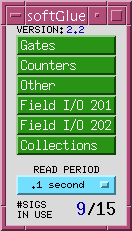

`softGlueMenu.adl` is the top softGlue display, which serves
mostly to call up other displays. The menu labelled `READ PERIOD`
specifies the period at which the values of all signals are
sampled for display to the user.

{: .note }
> Most softGlue displays are not interrupt driven. (That would be
> a disaster, because inevitably some signals will change state at
> high frequency.) So, the states of inputs and outputs must be
> sampled periodically, for display to the user. Polling
> everything at 0.1 second uses only a few percent of an MVME2700
> CPU, and we've found that it's confusing for users if the poll
> period is greater than around 1 second.

### Display elements

The following display shows all standard softGlue components on
one screen, with the signal named "clock" highlighted to show its
connections. Input connections are bordered in green, and output
connections are bordered in orange.

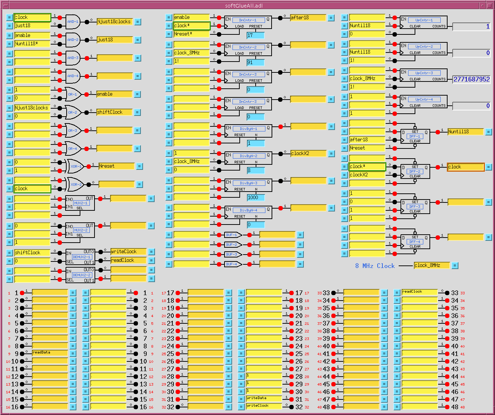

Each circuit element display follows the same layout. On the
left are the inputs, each comprised of a blue `=` button, a
yellow text-entry field, a number, and a red LED indicator. On the
right are essentially the same things in reverse order, but an
output's text-entry field is a different color. The color
difference is intended to remind you of the only rule governing
signal connections: if you connect two or more outputs together,
those outputs won't work.

{: .note }
> softGlue outputs are engineered to ensure that you can't break
> anything by connecting outputs together, but the circuit won't
> be useful until you fix the error, because the states of outputs
> connected together are undefined. Currently, softGlue doesn't
> signal this error by putting offenders into an alarm state.

The little red and black filled circles (LEDs), and the numbers
next to them, display the states of their signals. These display
elements are updated at the period specified in the
`softGlueMenu.adl` display. If you want the EPICS PV name
corresponding to a signal's logic value, this is the PV name to
use.

A signal's blue `=` button is used to find all other signals to
which the signal is connected. While a signal's `=` button is
pressed, input signals connected to it are bordered in green, and
output signals connected to it are bordered in orange. If you
ever see two or more orange borders at the same time, you have
outputs connected together, and your circuit won't work.

### Connecting signals

The yellow text-entry box controls an input. You have three
options:

1. **Leave empty.** Inputs with empty text-entry boxes default
   to logic value 1.

2. **Enter a string that begins with a number.** This directly
   writes a logic value (optionally, a pulse) to the input.

   softGlue will parse everything that looks numberish, and
   convert to a floating point value. This sets the input to a
   logic value: 0 if the nearest integer to the converted value
   is zero, 1 if it's not.

   {: .note }
   > Allowing floats, and extra characters after the number,
   > makes it easier to drive softGlue inputs with calcout
   > records, replies from serial devices, etc.

   The strings `0!` and `1!` (possibly followed by other ignored
   characters) direct softGlue to write a pair of logic values:
   `0!` writes `0` followed immediately by `1`; `1!` writes `1`
   followed immediately by `0`. The time interval between writes
   is system dependent, and not at all guaranteed, but it should
   be much smaller than the interval you could achieve from
   separate writes. On an MVME2700, the interval is around 6 us.

3. **Enter a string that begins with something other than a
   number.** This *names* the signal, and connects it to all
   other signals with the same name (or with the same name
   followed by `*`, as described below). Case is significant in
   comparing signal names.

A "signal", as the word is used in this documentation, is a named
connection between softGlue circuit elements. It might be more
intuitive to think of a "signal" as a wire, to avoid confusing it
with field I/O.

{: .important }
> If you're using more than one IP-EP20x module, you can't
> connect signals implemented in different IP-EP20x modules using
> their text-entry boxes. To accomplish this, you must connect the
> signals to field I/O and make a physical connection.

#### Signal inversion

If you want to use the inverted value of a signal for input to
some component, append `*` to the signal name. This doesn't
change the signal that the input is connected to, but just tells
softGlue to run the signal through an inverter before applying it
to the input. Note that output signal names may not end with `*`.

#### Signal name limits

You can define at most fifteen different signal names. When you
try to define the 16th name, softGlue will erase whatever you
wrote, and put the record into the "INVALID" alarm state. (But
note, for example, that `reset` and `reset*` are not different
signal names, because the trailing `*` is not regarded as part of
the name; it merely describes how the signal should be used.)

Text-entry boxes for output signals won't accept names beginning
with a number, or ending with `*`. (softGlue will simply strip
the offending characters, and leave the rest.)

{: .note }
> A signal name beginning with a number can only be a direct-write
> command; it cannot connect things together, because the leading
> number would be misinterpreted by input-signal-name parsing as a
> direct-write command. Output-signal names ending with `*` are
> logically sensible, but are not permitted; this simplifies the
> implementation of `*` appended to input-signal names.

#### Drag-and-drop / copy-paste

In MEDM, you can use Drag-And-Drop to connect a named signal to
some other signal. When you drop, MEDM will put the PV name of
the signal you dragged from. When you press `Enter`, softGlue's
device support will write the signal name of the source PV to the
destination PV.

In caQtDM, you can select the text of a signal name, and use
Copy/Paste (Ctrl-C/Ctrl-V) to copy the signal name from one
text-entry box to another.

### Field I/O

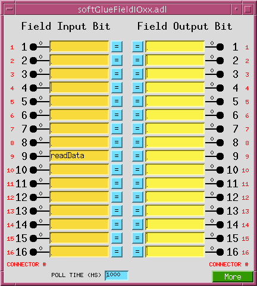

This display allows you to connect field I/O signals to each
other and to softGlue circuits. Note that a "Field Input Bit"
looks like and behaves as a softGlue *output*, because what
you're actually controlling is the output of a buffer driven by
the field-input signal. Similarly, a "Field Output Bit" looks
like and behaves as a softGlue *input*, because you're actually
controlling the input of a buffer that drives the field-output
signal.

The signals in this display are the field inputs or outputs
connected to pins 1-16, 17-32, or 33-48 on the IP-EP201's
ribbon connector. The IP-EP201 board supports 48 I/O bits, and
permits them to be set for input or output in groups of 8.

`POLL TIME (MS)` specifies the period at which softGlue reads
the I/O ports for user-display purposes, and for executing the
EPICS link associated with non-interrupt-enabled I/O bits (see
next section). If an I/O bit has changed value since the last
read, softGlue processes the display record associated with that
bit, so the user will see the new value. If an I/O bit is enabled
to generate interrupts, as described in the next section, the bit
will be read immediately by the interrupt handler, so `POLL TIME`
will not matter for that bit.

If you have a field input connected to an FPGA component, the
component will react to a change in the input value within
nanoseconds. I/O polling is not involved at all in the logic
connection.

{: .note }
> You can change the `CONNECTOR #` strings in this display -- for
> example, to support a custom signal-breakout module, or to give
> the I/O signals application-specific names. The strings are
> defined in `softGlueApp/Db/softGlue_FPGAContent.substitutions`,
> as the macro `IOPIN` supplied to `softGlue_FieldOutput.db` and
> `softGlue_FieldInput.db`. In softGlue 2.3.1, field I/O displays
> leave room for longer strings, and there is an autosave-request
> file for these PVs.

During a VME power cycle, and during a VME reset, field outputs
are first put into a high impedance state, then are driven to
ground, and finally are driven to values controlled by the user
circuit. If user-circuit field-outputs are autosaved, they will be
restored during the boot; otherwise, they will default to logic 1
(+5V for TTL).

During a soft reboot (that is, when the vxWorks `reboot` command
is given in the IOC console), field outputs will maintain their
values.

### Field I/O interrupt support

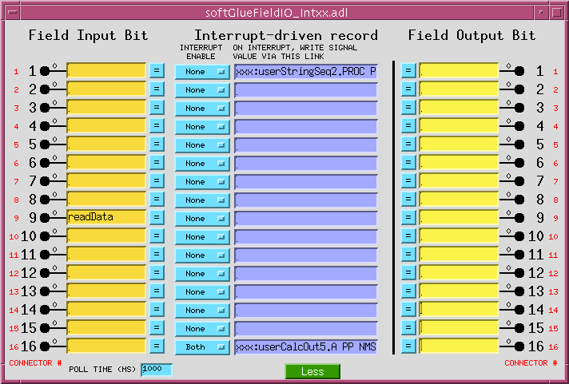

Field-input lines supported by softGlue can generate interrupts
on rising edges, falling edges, both, or neither. You control
this by setting the `INTERRUPT ENABLE` menu to `Rising`,
`Falling`, `Both`, or `None`, respectively. Field output lines
can also generate interrupts: if a bit is designated as an output,
the output is connected also to the input, and to the input's
interrupt-generation circuitry.

Interrupts are throttled by softGlue's interrupt handler. If more
than four interrupts have occurred and not been handled, softGlue
will disable interrupts from the offending bit, by setting the
bit's `INTERRUPT ENABLE` menu to `None`, and it will direct your
attention to the change by drawing a red box around the menu
control. The box will be erased the next time the menu is written
to.

{: .note }
> The number of unhandled interrupts that triggers throttling is
> adjustable by modifying `drvIP_EP201.c`. You must change the
> definition of `MAX_IRQ`, and you must also ensure that the asyn
> ring buffers for interrupt driven PVs is larger than `MAX_IRQ`.
> (The default ring buffer size is 10. Asyn documentation
> describes how to change it.)

When an interrupt occurs, you can have the signal value written to
an EPICS PV, by writing an EPICS link description into the purple
box labelled "ON INTERRUPT, WRITE SIGNAL VALUE VIA THIS LINK", as
shown for input 16 in the above screen shot.

*For interrupts that may occur too closely spaced in time for
softGlue's normal interrupt-response mechanism to handle
reliably, see "Custom interrupt handlers" below.*

#### About EPICS links

In softGlue displays (and in most other synApps displays),
standard EPICS links are displayed as purple text-entry boxes, in
which you describe the link you want to make. For purposes here,
an EPICS link description is the name of an EPICS PV, followed by
one of the following link attributes:

| Attribute | Description |
| - | - |
| NPP | (default) Write value, but do not cause processing. |
| PP | Write value and cause processing (if the record containing the PV is "Process Passive", which means that its SCAN field has the value "Passive"). You should use this attribute unless you have some reason not to. |
| CA | Write value and let the record containing the PV decide whether or not to process. |

{: .note }
> EPICS will tack on the string " NMS". This alarm-propagation
> attribute is not something end users need to worry about.

For example, to cause a link to write effectively to the top
input of the first AND gate (whose PV name is
`xxx:softGlue:AND-1_IN1_Signal`), you would write the following
into a purple box:

```
xxx:softGlue:AND-1_IN1_Signal PP
```

If you only write the PV name, EPICS will supply the link
attribute `NPP`, and your link will write a value, but the value
won't have any effect until the next time the record processes.
(For most PVs in softGlue, the value written by an NPP link
won't even be displayed until the record processes.)

If the link writes to a PV in a different IOC, the specified link
attribute will be ignored, and the attribute `CA` will be used
instead.

### Convenience

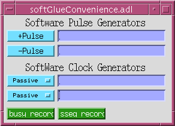

This display controls two pulse generators implemented in EPICS,
with links allowing them to write to a softGlue input (that is,
to a yellow box), and, similarly, two clock generators implemented
in EPICS. The display also has MEDM related-display callups for
two busy records.

The use of EPICS links (the purple boxes in the above display) is
described in "About EPICS links" above.

### Busy record

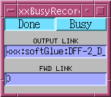

This display controls the value, output link, and forward link of
a busy record. In the anticipated use with softGlue, one would
have some EPICS record outside of softGlue set the busy record to
"Busy" (using a PP link), and arrange for a softGlue interrupt
bit (see "Field I/O interrupt support" above) to use its
EPICS-output link to clear the busy record to "Done" (using a CA
link).

{: .important }
> It's important to **set** a busy record to "Busy" using a PP
> link, because the purpose of a busy record is to represent some
> external processing as EPICS processing. This allows EPICS'
> execution tracing to signal the completion of the processing.
> EPICS only traces processing started or propagated with a PP
> link. It's important to **clear** a busy record to "Done" with
> a CA link, because an EPICS PP link will decline to process any
> record that is already processing. The busy record is written
> so that a CA put will succeed in clearing it and causing its
> processing to appear done to EPICS.

## Circuit element reference

In truth tables, `x` means "either 0 or 1".

### Logic gates

**AND**

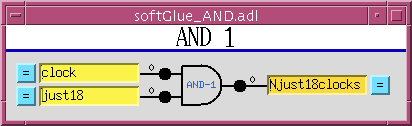

| input1 | input2 | output |
| - | - | - |
| 0 | x | 0 |
| x | 0 | 0 |
| 1 | 1 | 1 |

---

**OR**

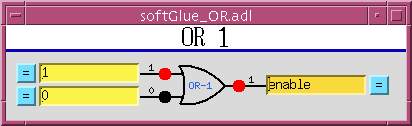

| input1 | input2 | output |
| - | - | - |
| 0 | 0 | 0 |
| 1 | x | 1 |
| x | 1 | 1 |

---

**XOR**

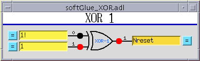

| input1 | input2 | output |
| - | - | - |
| 0 | 0 | 0 |
| 0 | 1 | 1 |
| 1 | 0 | 1 |
| 1 | 1 | 0 |

---

**Buffer**

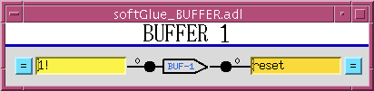

The purpose of the buffer element is to permit EPICS to drive
several softGlue inputs by writing to a single PV, without
using up a more valuable circuit element, such as the XOR gate.

---

**Inverting buffer**

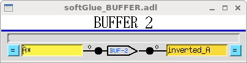

There is no inverting buffer -- or any other inverting gate -- in
softGlue. Signal inversion is accomplished by appending `*` to
the name of a signal used as input to any logic element, as
demonstrated above for the buffer element. Note that `*` appended
to the name of an output signal will be removed.

### Flip-flops and multiplexers

**D flip-flop**

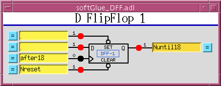

The input signal labelled `>` is the "clock" input. Unlike other
signals, clock inputs are edge sensitive. All clock inputs in
softGlue act on the rising edge of the input signal.

The open circle ("bubble") in the `SET` and `CLEAR` inputs'
signal paths indicate that these signals are inverted before
being used. Thus, applying `0` to the `CLEAR` input causes the
output to be "cleared" (given the value 0).

| SET | CLEAR | D | `>` (clock) | Q |
| - | - | - | - | - |
| 0 | 0 | x | x | undefined |
| 0 | 1 | x | x | 1 |
| 1 | 0 | x | x | 0 |
| 1 | 1 | any | rising edge | D_BEFORE (value D had immediately before the rising edge of the clock signal) |

---

**2-input multiplexer**

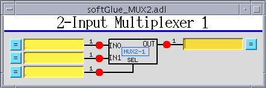

When `SEL==0`, `OUT=IN0`. When `SEL==1`, `OUT=IN1`.

---

**2-output demultiplexer**

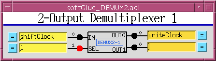

When `SEL==0`, `OUT0=IN`, and `OUT1` is undefined (currently 0).
When `SEL==1`, `OUT1=IN`, and `OUT0` is undefined (currently 0).

### Counters and timers

**Up counter (32-bit)**

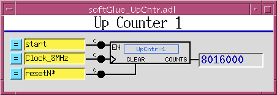

`EN==1` enables the clock (`>`) input, whose rising edge
increments the counter value.

---

**Down counter (32-bit preset)**

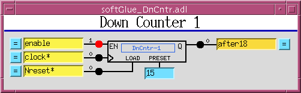

`EN==1` enables the clock (`>`) input, whose rising edge
decrements the counter value. When `LOAD==1` the counter is
loaded with the value applied to the `PRESET` input. While
`LOAD==1`, the counter does not count down. While `LOAD==0` and
`EN==1`, a rising edge at the clock input decrements the counter.
When the counter value reaches `0`, the output `Q` goes to `1`;
the next rising edge of the clock returns `Q` to `0` (regardless
of the states of `EN` and `LOAD`).

---

**32-bit divide by N**

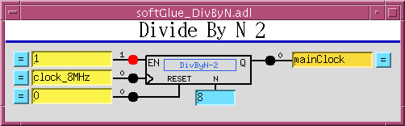

`EN==1` enables the clock (`>`) input. Every `N`th rising edge
of the clock drives `Q` to `1`. The next rising edge returns `Q`
to `0`. This behavior produces the correct number of rising edges
of the output signal, but it does not guarantee the same number
of falling edges. Therefore, using an inverted copy of the output
to clock downstream electronics will in some cases have
inconsistent results. When `N==0`, the divide circuitry is
bypassed, and the clock is connected directly to `Q`. This is an
error; the output should still be gated by the `EN` signal.

In softGlue version 2.1 and earlier, the `RESET` signal doesn't
do anything. Beginning with softGlue 2.2, the `RESET` signal
loads the counter with `N`, so that `Q` will be driven to `1`
after `N` rising edges of the clock. `RESET` does not clear the
output `Q`. If `Q` is `1`, it will be cleared on the first rising
edge of the clock.

---

**8 MHz internal clock**

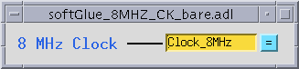

An 8 MHz clock derived from the IndustryPack clock is available
to softGlue circuitry as a free standing output.

## Add-on FPGA components

The following components are not in the standard softGlue
package, but in add-on packages typically made to solve specific
problems.

**32-bit up/down counter**

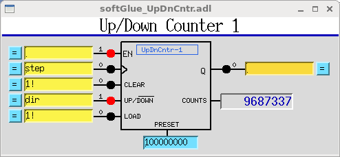

`EN==1` enables the clock (`>`) input. `CLEAR==1` sets the
current count and the output value `Q` to zero. When
`UP/DOWN==1` the counter counts up. `LOAD` sets the current
count to `PRESET`.

---

**Quadrature decoder**

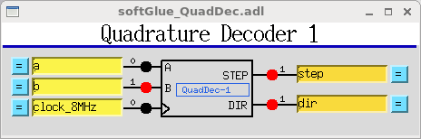

This circuit converts a pair of digital quadrature signals `A`,
`B` (for example, signals from an encoder) into a pair of `STEP`,
`DIR` signals. `A` and `B` are sampled on rising edges of the
`CLOCK` signal. If either have changed since the last rising
edge, the travel direction implied by the change is output to
`DIR`, and a pulse is output to `STEP`. The pulse width is equal
to the period of the `CLOCK` signal, and the input frequency may
not be greater than half the clock frequency.

---

**Shift register**

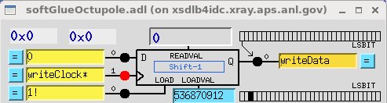

This circuit converts from parallel to serial, or from serial to
parallel.

For parallel-to-serial conversion, a number is written into the
`LOADVAL` register, and loaded by a positive-going pulse to the
`LOAD` input. On each rising edge of the clock input `>`, the
loaded value is shifted toward the most significant bit, and the
most significant bit is output to the Q output.

For serial-to-parallel conversion, the input `D` is sampled on
the rising edge of the clock input, and that value is shifted
into the least significant bit of the register.

---

**Four-output demultiplexer**

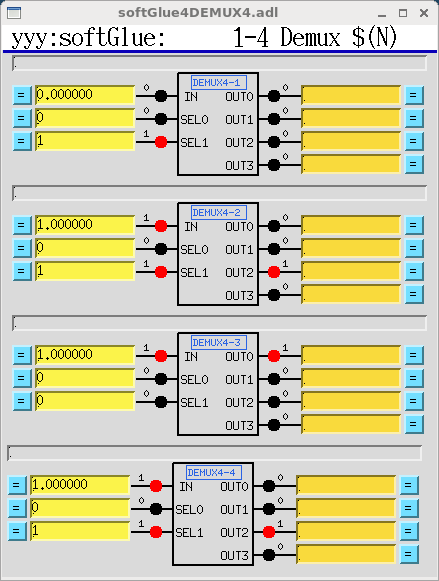

When `SEL0==0` and `SEL1==0`, `OUT0=IN`, and other OUTs are
undefined (currently 0).

When `SEL0==1` and `SEL1==0`, `OUT1=IN`, and other OUTs are
undefined (currently 0).

When `SEL0==0` and `SEL1==1`, `OUT2=IN`, and other OUTs are
undefined (currently 0).

When `SEL0==1` and `SEL1==1`, `OUT3=IN`, and other OUTs are
undefined (currently 0).

There are two copies of this add-on component:

1. `SoftGlue_2_2_demux4.hex` -- the basic component, with all
   inputs and outputs routed to signal names, as usual for
   softGlue.
2. `SoftGlue_2_2_demux4_HW.hex` -- the same component, but with
   multiplexer outputs routed to signal names, as usual, and also
   hardwired to the last 16 field I/O pins. Thus,
   `DEMUX4-1_OUT0` is connected to pin 33, `DEMUX4-1_OUT1` is
   connected to pin 34, ..., and `DEMUX4-4_OUT3` is connected to
   pin 48.

---

**Encoder time average circuit**

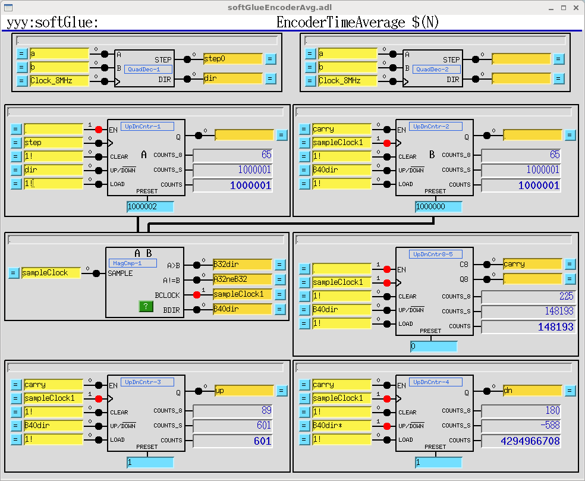

This circuit is for general encoder support, and also for
generating a time averaged value of an encoder signal. Up/Down
counters 1-4 are copies of the 32-bit Up/Down counter described
above. Up/Down counter 5 is also a 32-bit Up/Down counter, but
it has no `Q` output. Instead, it has `Q8` and `C8` outputs. `Q8`
is true whenever the 8 least significant bits are all zero. `C8`
is a ripple carry bit, which allows the eight least significant
bits of this counter to be combined with any 32-bit counter to
make a 40-bit counter.

MagCmp-1 is a 32-bit magnitude comparator, which produces the
signals `A>B` and `A!=B` on the rising edge of the clock
`SAMPLE`. The component also produces the signals `BCLOCK` and
`BDIR` with the following circuitry, which uses the `Q8` signal
from Up/Down counter 5:

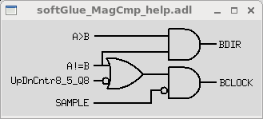

## Saving and restoring circuits

softGlue circuits can be saved and restored using
[autosave](https://epics-modules.github.io/autosave/),
autosave's *configMenu* facility,
[BURT](http://www.aps.anl.gov/epics/extensions/burt/index.php),
or any channel access client that can read and write PVs.
configMenu is particularly handy, because it's driven by EPICS
PVs, and because it saves a time-stamped backup copy of every
file it overwrites. Whichever method you use, you may need to
clear softGlue signal names before loading a circuit, because
loading over an existing circuit could temporarily exceed the
available number of signal names. (Alternatively, you could
simply load twice, and be confident that the second load will
succeed.)

### Using autosave's configMenu

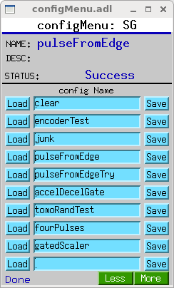

If you have autosave R5-1 or higher, you can use configMenu to
save and restore circuits. Here are the steps needed to implement
a menu of softGlue circuits, and to give the user a GUI display
for saving and restoring them. (In the following, `SG` is the
name of this instance of configMenu. The files it loads and saves
will be named `SG_<config Name>.cfg`. For example, the configMenu
instance pictured above has files named `SG_clear.cfg`,
`SG_encoderTest.cfg`, etc.)

1. In the IOC's startup directory, create an autosave request
   file, which I'll call `SGMenu.req`, with the following
   content:

   ```
   file configMenu.req P=$(P),CONFIG=$(CONFIG)
   file softGlue_settings.req  P=$(P),H=$(H)
   ```

2. Uncomment the following line in the IOC's copy of
   `softGlue.cmd`:

   ```
   dbLoadRecords("$(AUTOSAVE)/asApp/Db/configMenu.db","P=xxx:,CONFIG=SG")
   ```

3. Add the following line to `st.cmd`:

   ```
   create_manual_set("SGMenu.req","P=xxx:,CONFIG=SG")
   ```

4. Add an MEDM related-display entry to bring up the
   `configMenu.adl` display:

   ```
   label="SGMenu" name="configMenu.adl" args="P=xxx:,CONFIG=SG"
   ```

softGlue includes configMenu files (`*.cfg`) for standard example
circuits in the `iocBoot/iocSoftGlue` directory. In actual use,
these `.cfg` files would be placed in your application's
`iocBoot/iocxxx/autosave` directory. For more information on
configMenu, see the autosave documentation.

### Using BURT

The BURT request file `softGlueApp/op/burt/softGlue.snap` can be
used to save all softGlue user modifiable PVs. For example, the
following command saves the state of softGlue to the file
`myCircuit.snap`:

```
burtrb -f softGlue.req -DPREFIX=xxx:softGlue -o myCircuit.snap
```

{: .important }
> `-f softGlue.req` specifies that the request file
> `softGlue.req` should be used to specify the EPICS PVs whose
> values are to be saved. This file contains lines like
> `PREFIX:AND-1_IN1_Signal`, where `PREFIX` is to be replaced by
> text specific to your IOC. `-DPREFIX=xxx:softGlue` specifies
> that `PREFIX` is to be replaced by `xxx:softGlue`.
> `-o myCircuit.snap` specifies that the saved PV names and
> values are to be written to the snapshot file
> `myCircuit.snap`. No doubt your PREFIX will be different from
> mine, but it should be `$(P)$(H)` from your copy of
> `softGlue.cmd`, minus the trailing `:` from `$(H)`. BURT needs
> the `:` to separate "PREFIX" from the rest of the PV names it
> parses. If you defined `H` without a trailing `:`, you'll need
> to make some adjustment to satisfy BURT.

The following commands restore the circuit:

```
burtwb -f clearAll.snap
```

```
burtwb -f myCircuit.snap
```

The first command is often needed because there is a limit to the
number of signal names that softGlue will accept. If you neglect
to clear all signals before restoring a circuit, the allowed
number of signal names might be exceeded during the restore, if
new signal names are defined before old signal names are deleted.
(Alternatively, you could simply run the second command twice.)

To restore example circuits included in the softGlue module, or
to restore a snapshot file emailed to you by some other softGlue
user, you will need to edit the snapshot file to change PV names
such as `xxx:softGlue:AND-1_IN2_Signal` to PV names in your IOC,
which might look like `1ida:softGlue:AND-1_IN2_Signal`.

## Example circuits

The following circuits have been tested and saved in BURT snapshot
files, and as configMenu `.cfg` files, as described above (see
*Saving and restoring circuits*). The snapshot files can be found
in `softGlueApp/op/burt`; the `.cfg` files are in
`iocBoot/iocSoftGlue`.

### Motor-pulse gate

Positive-going pulses can be gated with an AND gate, by applying
the signal to one input of the AND gate, and setting the other
input to `0` (deny) or `1` (allow) to control passage through the
gate. Negative-going pulses can be gated with an OR gate, by
applying the signal to one input of the OR gate, and setting the
other input to `0` (allow) or `1` (deny) to control passage
through the gate.

### Gated scaler

*Files: `softGlueApp/op/burt/gatedScaler.snap` or
`iocBoot/iocSoftGlue/gatedScaler.cfg`*

This circuit implements four counter channels, a time base to
control counting time, an overall gate, and additional circuitry
to control starting, stopping, and processing of the count-value
records. Note that the scaler is controlled by a busy record from
the softGlue convenience database, so that client software can
discover when counting is finished in the standard EPICS way. See
`softGlueApp/op/burt/gatedScaler.txt` for more details.

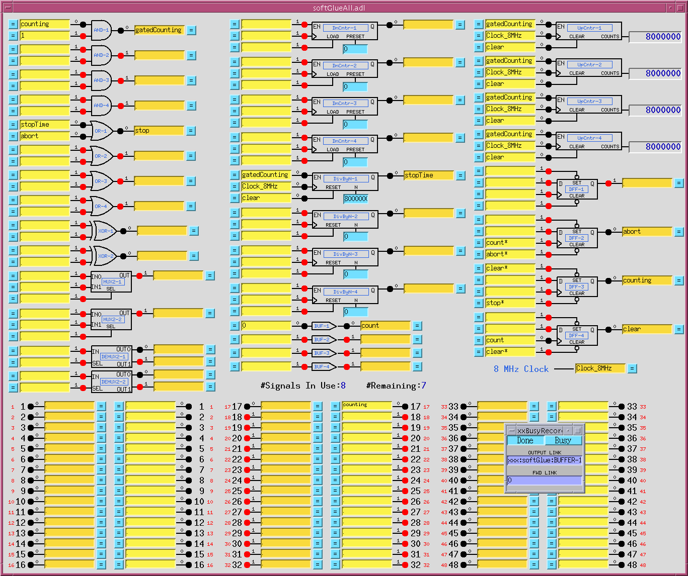

### Four independent pulses

*Files: `softGlueApp/op/burt/fourPulses.snap` or
`iocBoot/iocSoftGlue/fourPulses.cfg`*

This circuit produces four separate pulse signals, which start at
specified start-delay times after (the falling edge of) an initial
start pulse, and which last for specified pulse-length times. It
uses four DnCntrs to implement the start-delay times, and four
DivByNs to implement the pulse-length times. Times are specified
as multiples of the (125 ns) clock period (`PRESET` for the
DnCntrs; `N` for the DivByNs), and these numbers must be greater
than or equal to 1. The pulse sequence starts on the falling edge
of the signal `BUF-1`, written by a periodically scanned EPICS
record (one of the softGlue convenience clocks). One spare signal
name is available, however, so the pulse sequence could also be
started by an external signal.

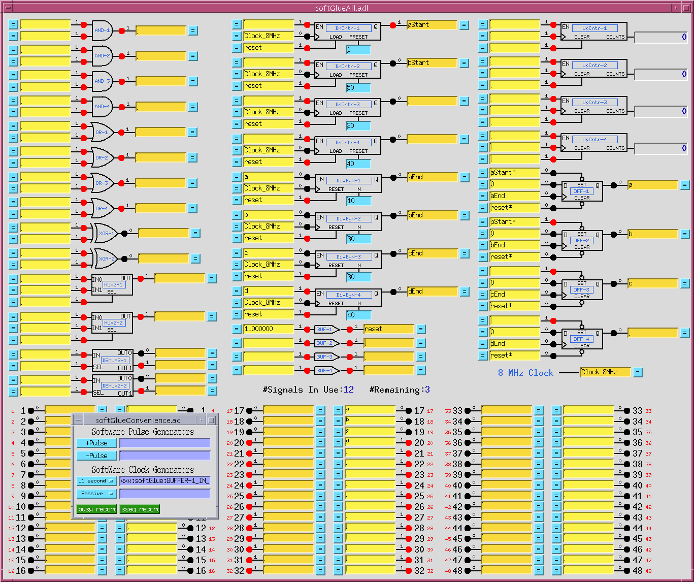

### Motor-pulse accel/decel gate

*Files: `softGlueApp/op/burt/accelDecelGate.snap` or
`iocBoot/iocSoftGlue/accelDecelGate.cfg`*

(Non-softGlue support in
`softGlueApp/op/burt/accelDecelGate_transform.sav`.)

If you know the number of steps a stepper motor will move during
its acceleration time, you can easily arrange to deliver motor
pulses to some external circuit only while the motor is moving at
constant speed. For a stepper motor controlled by the motor
record, the number of acceleration/deceleration steps, *N_a*, can
be calculated with the following formula:

*N_a* = ((`VBAS` + `VELO`) / 2) * `ACCL` / `MRES`

where `VBAS`, `VELO`, `ACCL`, and `MRES` are motor record fields.

The number of constant-speed steps, *N_c*, is then

*N_c* = ((*VAL_end* - *VAL_start*) / `MRES`) - 2 * *N_a*

where *VAL_end* and *VAL_start* are the final and initial values
of the motor record `VAL` field.

The following circuit accepts negative-going motor pulses at
input signal 1, gates out the first 11 (the value of
`DnCntr-1_PRESET`), and from then on sends motor pulses to output
pin 17 until a total of 31 (the value of `DnCntr-2_PRESET`) have
been sent. The circuit is reset by writing `1!` (positive-going
pulse) to the input of `BUF-1`.

The circuit includes some diagnostics, and a mechanism for
testing:

- `UpCntr-1` counts all motor pulses; `UpCntr-2` counts gated
  motor pulses. Both counters are reset by the same signal that
  resets the gate circuit.
- A manual reset is implemented using `BUF-1`. Writing `1!` to
  the input of `BUF-1`, as shown, causes a short positive-going
  pulse to be applied to it, and thus to its output, the signal
  named "reset".

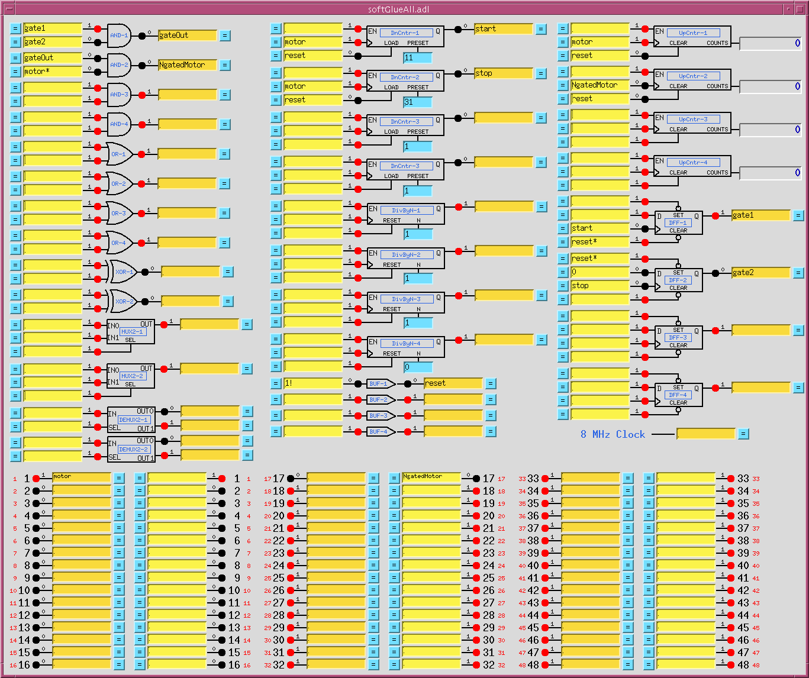

Down counter `DnCntr-1`, and flipflop `DFF-1`, together produce a
gate signal that is 0 after a reset, and that goes to 1 after
`DnCntr-1_PRESET` motor pulses. Down counter `DnCntr-2`, and
flipflop `DFF-2`, together produce a gate signal that is 1 after
a reset, and that goes to 0 after `DnCntr-2_PRESET` motor pulses.
We load the number of acceleration steps into
`DnCntr-1_PRESET`, and the number of acceleration steps plus
constant-speed steps into `DnCntr-2_PRESET`.

`AND-1` combines the gate signals produced above into a signal
that is 1 while the motor is moving at constant speed.

`AND-2` gates the negative-going motor pulses, using what was
described in the "Motor-pulse gate" example as a positive-going
pulse gate, by inverting the "motor" signal before applying it to
the gate.

Note that the down counters are clocked by (rising edges of)
"motor", to produce the signal used to gate `motor*`. This choice
avoids a race condition between simultaneous rising edges of
"gateOut" and "motor". (This circuit gates negative-going motor
pulses, so another way to make the point is to say that the
trailing edge of a motor pulse is used to produce a gate that will
be ready in plenty of time for the leading edge of the next motor
pulse.)

Calculations for the circuit are shown in the following screen
capture of a transform record.

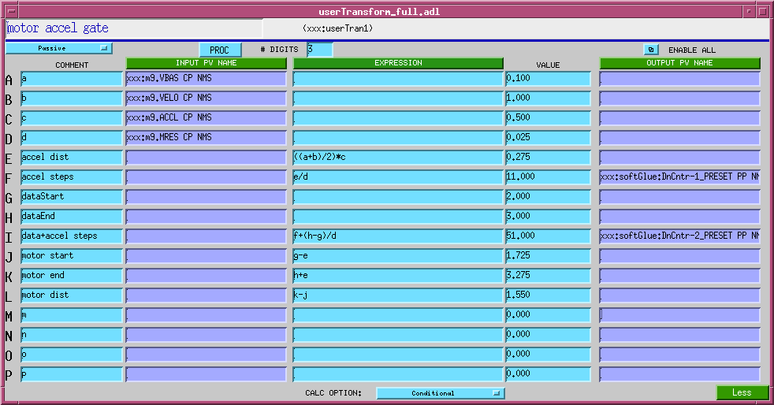

## Custom interrupt handlers

softGlue's normal interrupt-response mechanism allows you to
specify the execution of an EPICS output link, which will write to
and possibly process a specified EPICS record, whenever an enabled
interrupt occurs. This mechanism is unreliable for interrupts that
are spaced in time by less than a few milliseconds, because the
EPICS processing is dispatched through message queues, and
requires several task switches before the target record gets
processed.

For interrupts that may occur more closely spaced in time, you can
write a custom interrupt-handler routine, and tell softGlue to
call it at interrupt level whenever an enabled interrupt occurs.
There is an example in the `softGlueApp/src` directory:
`sampleCustomInterruptHandler.c`, which handles the following
application requirement:

*When an enabled interrupt occurs on a specified bit of a
specified IP_EP20x board, read a number from an array, write
that number to the `N` register of a specified softGlue DivByN
component on that same IP_EP20x board, and increment the array
index for the next read.*

`sampleCustomInterruptHandler.c` contains two functions:

`sampleCustomInterruptPrepare()` -- This function gathers some
information for use by `sampleCustomInterruptRoutine()`, and tells
softGlue to call `sampleCustomInterruptRoutine()` from its
interrupt-service routine when a specified interrupt occurs. The
interrupt is specified by `carrier` and `slot`, which specify the
IP_EP20x board; `sopcAddress`, which specifies the address of one
of three I/O registers on the board; and `mask`, which specifies
one or more bits of the specified I/O register.

`sampleCustomInterruptRoutine()` -- This function executes at
interrupt level, reads a number from an array, writes that number
to the `N` register whose VME addresses were calculated by
`sampleCustomInterruptPrepare()`, and increments the array index.

Other files in `softGlueApp/src` that help implement
`sampleCustomInterruptHandler` are `Makefile`, which builds it,
and `softGlueSupport.dbd`, which contains the line
`registrar(sampleCustomInterruptRegistrar)`.


